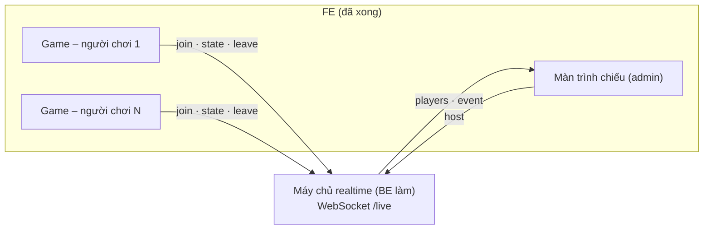

# Máy chủ realtime cho màn trình chiếu – tài liệu cho BE (Node.js)

Tài liệu dành cho lập trình viên backend Node.js làm máy chủ realtime cho **màn trình chiếu** của game RoleCraft PM60. Phần FE (game và màn trình chiếu) đã xong và đang chạy với một máy chủ giả lập (mock). BE chỉ cần làm máy chủ nói đúng giao thức dưới đây, FE không phải sửa gì.

Mục lục: [1. Tính năng](#1-tính-năng) · [2. Kiến trúc](#2-kiến-trúc) · [3. Kết nối](#3-kết-nối) · [4. Tin nhắn](#4-tin-nhắn) · [5. Quy tắc xử lý](#5-quy-tắc-xử-lý) · [6. Bảo mật và giới hạn](#6-bảo-mật-và-giới-hạn) · [7. Triển khai bằng Node.js](#7-triển-khai-bằng-nodejs) · [8. Kiểm tra](#8-kiểm-tra) · [9. Phía FE đã làm gì](#9-phía-fe-đã-làm-gì)

---

## 1. Tính năng

- Admin mở **màn trình chiếu** trên máy chiếu: một **mã QR cố định** (chỉ là link vào game) và **danh sách người chơi** cập nhật realtime.
- Người chơi quét QR bằng điện thoại, nhập tên, bắt đầu chơi → xuất hiện ngay trên danh sách.
- Mỗi người chơi **độc lập**: không có phòng, không chơi cùng nhau. Màn trình chiếu chỉ để **xem** ai đang chơi, ai đã xong, ai đã rời.

Trạng thái mỗi người chơi trên màn trình chiếu:

| Trạng thái | Khi nào | Màn trình chiếu hiện |
|---|---|---|
| `playing` | Đã vào (nhập tên xong), đang kết nối | "Đang ở sảnh" hoặc "LV2 · Ngày 18/60" |
| `finished` | Game báo có kết quả thử việc | Nhãn kết quả (Pass, Gia hạn, Buộc thôi việc…) + ngày dừng |
| `left` | Bấm Thoát trong game, **hoặc** mất kết nối quá 10 giây không nối lại | "Rời lúc 16:14", thẻ mờ |

Kèm dòng **Hoạt động gần đây**: ai vừa tham gia, quay lại, hoàn thành, rời.

## 2. Kiến trúc



- Một kết nối WebSocket cho mỗi tab game và mỗi màn trình chiếu.
- Máy chủ giữ **một danh sách chung** người chơi (trong bộ nhớ là đủ, xem [mục 7](#7-triển-khai-bằng-nodejs)).
- Người chơi chỉ **gửi lên**; chỉ màn trình chiếu (admin) **nhận** danh sách.

## 3. Kết nối

| Mục | Giá trị |
|---|---|
| Giao thức | WebSocket, khung **text**, nội dung là **JSON** (mỗi khung một tin nhắn) |
| Đường dẫn | Mặc định `/live` **cùng domain với trang game** (`wss://game.example.com/live`). Web chủ đổi được qua prop `liveUrl` |
| Kích thước tin | Tối đa **2 KB** (tin lớn hơn: đóng kết nối) |
| Heartbeat | Máy chủ gửi `ping` mỗi **15 giây**; không nhận `pong` ở lần kế tiếp → `terminate()` kết nối (trình duyệt tự trả `pong`, FE không cần làm gì) |
| Nối lại | FE tự nối lại khi rớt mạng (1 s, 2 s, 4 s… tối đa 10 s) và **gửi lại `join` + `state` / `host`** sau mỗi lần nối |

Sau reverse proxy (nginx) cần bật nâng cấp WebSocket và tăng thời gian chờ đọc:

```nginx
location /live {
    proxy_pass http://rolecraft_live;          # upstream Node.js
    proxy_http_version 1.1;
    proxy_set_header Upgrade $http_upgrade;
    proxy_set_header Connection "upgrade";
    proxy_set_header Host $host;
    proxy_set_header X-Forwarded-For $proxy_add_x_forwarded_for;
    proxy_read_timeout 75s;                    # > chu kỳ ping 15 s
}
```

## 4. Tin nhắn

Định nghĩa kiểu TypeScript chuẩn nằm ở [`src/live/protocol.ts`](../src/live/protocol.ts) (không có logic, BE có thể chép nguyên file). Mọi tin nhắn có trường `t` là loại tin.

### 4.1. Client → máy chủ

| `t` | Ai gửi | Trường | Khi nào |
|---|---|---|---|
| `host` | Màn trình chiếu | – | Ngay khi mở kết nối (và mỗi lần nối lại) |
| `join` | Game | `id` (chuỗi 8–40 ký tự `[A-Za-z0-9_-]`), `name` (2–24 ký tự) | Khi người chơi đã nhập tên và qua màn nhận thẻ; mỗi lần nối lại |
| `state` | Game | `where` (`"lobby"` \| `"play"`), `level` (số nguyên 1–4, có thể thiếu), `day` (0–60, có thể thiếu), `result` (object hoặc `null`) | Ngay sau `join`, mỗi khi đổi màn / chọn xong một tình huống / có kết quả |
| `leave` | Game | – | Người chơi bấm **Thoát** |

```json
{ "t": "host" }
{ "t": "join", "id": "9f2c4be1a07d3e5c8b6a1f20", "name": "Nguyễn Khánh An" }
{ "t": "state", "where": "play", "level": 2, "day": 18, "result": null }
{ "t": "state", "where": "play", "level": 4, "day": 60, "result": { "code": "PASS", "label": "Pass", "mood": "good" } }
{ "t": "leave" }
```

- `id` do FE sinh ngẫu nhiên và giữ theo **tab** (tải lại trang vẫn cùng `id`; tab mới là người chơi mới). Không phải id tài khoản.
- `result.code`: `PASS_EXCELLENT` \| `PASS` \| `EXTEND_PROBATION` \| `FAIL`; `label` là chữ hiển thị (vd "Buộc thôi việc"); `mood`: `good` \| `mid` \| `bad` (màu nhãn).

### 4.2. Máy chủ → client

| `t` | Gửi cho | Trường | Khi nào |
|---|---|---|---|
| `players` | Màn trình chiếu | `players`: **toàn bộ** danh sách (`LivePlayer[]`) | Ngay sau `host`; mỗi khi danh sách đổi (nên gộp các thay đổi trong ~100 ms thành một lần gửi) |
| `event` | Màn trình chiếu | `event`: `{ kind, id, name, at, label?, mood? }` | Mỗi hoạt động; ngay sau `host` gửi lại lịch sử gần đây (tối đa 30, **cũ → mới**) |
| `joined` | Game | – | Trả lời `join` hợp lệ |
| `error` | Bên gửi sai | `code` (`bad` \| `full` \| `auth`), `message` (tiếng Việt) | Tin nhắn không hợp lệ, hết chỗ, không có quyền admin |

`LivePlayer`:

```jsonc
{
  "id": "9f2c4be1a07d3e5c8b6a1f20",
  "name": "Nguyễn Khánh An",
  "status": "playing",                 // playing | finished | left
  "where": "play",                     // lobby | play
  "level": 2, "day": 18,               // có thể thiếu
  "result": null,                      // hoặc { code, label, mood }
  "joinedAt": 1790000000000,           // ms, giờ máy chủ
  "updatedAt": 1790000123000
}
```

`event.kind`: `join` (người mới), `back` (người đã rời quay lại), `finish` (có kết quả, kèm `label` và `mood` lấy từ `result`), `leave` (rời). `at` là ms giờ máy chủ.

Thứ tự `players`: `playing` → `finished` → `left`; cùng trạng thái thì ai vào trước đứng trước.

## 5. Quy tắc xử lý

**`host`**
1. Kiểm tra quyền admin ([mục 6](#6-bảo-mật-và-giới-hạn)); không có quyền → `error` `auth`, đóng kết nối.
2. Thêm kết nối vào tập "người xem".
3. Gửi `players` (toàn bộ) rồi các `event` gần đây (cũ → mới).

**`join`**
1. Kiểm tra `id` theo mẫu `^[\w-]{8,40}$`; chuẩn hoá `name` (NFC, bỏ ký tự điều khiển, gộp khoảng trắng, cắt 24 ký tự); tên dưới 2 ký tự → `error` `bad`.
2. Gắn kết nối với `id`. Huỷ hẹn "đã rời" của `id` nếu đang chờ (người chơi tải lại trang kịp).
3. `id` mới → thêm người chơi `status: playing`, `where: lobby`, phát `event` `join`.
   `id` đã có:
   - đang `left` → chuyển lại `playing` (hoặc `finished` nếu đã có kết quả), phát `event` `back`;
   - còn lại → chỉ cập nhật tên.
4. Trả `joined`, đẩy `players` cho người xem.

**`state`** (chỉ nhận từ kết nối đã `join`; chưa join thì bỏ qua)
1. `where` khác `"play"` coi là `"lobby"`. `level`, `day` phải là số nguyên trong miền (`level` 0–99, `day` 0–60), sai thì bỏ trường đó.
2. `result` phải đủ `code`, `label` là chuỗi và `mood` hợp lệ; sai → coi như `null`.
3. Có `result` → `status: finished`; nếu trước đó chưa `finished` thì phát `event` `finish` kèm `label`, `mood` của kết quả.
   Không có `result` → `status: playing` (người chơi chơi lại sau khi xong).
4. Đẩy `players`.

**`leave`** → đánh dấu `left` **ngay**, phát `event` `leave`, bỏ gắn kết nối với `id`.

**Kết nối của người chơi đóng** (không `leave`: đóng tab, mất mạng, khoá màn hình lâu)
- Nếu `id` còn kết nối khác đang mở (tab tải lại mở kết nối mới trước khi kết nối cũ đóng) → không làm gì.
- Không còn → hẹn **10 giây** (`GRACE_MS`); hết hẹn mà chưa `join` lại → `left` + `event` `leave`.

**Dọn dẹp**: người chơi `left` quá 1 giờ có thể xoá khỏi danh sách (mock đang làm vậy). Khởi động lại máy chủ thì danh sách về rỗng; FE tự nối lại và gửi lại `join` + `state`, nên người đang chơi sẽ xuất hiện lại.

## 6. Bảo mật và giới hạn

| Hạng mục | Yêu cầu |
|---|---|
| Quyền admin cho `host` | **Bắt buộc**: danh sách chứa tên người chơi. Cách đơn giản nhất: trang game và `/live` cùng domain → trình duyệt tự gửi **cookie phiên đăng nhập** trong request nâng cấp WebSocket; BE đọc cookie ở sự kiện `upgrade` (hoặc `verifyClient`), ghi nhận kết nối này là admin, và chỉ chấp nhận `host` từ kết nối admin. Khác domain: cho phép token ngắn hạn trong query (`/live?token=...`) do web chủ cấp. |
| Người chơi | Không cần đăng nhập (người chơi quét QR vào thẳng). Nếu web chủ bắt đăng nhập thì kiểm tra cookie tương tự và có thể lấy tên thật từ tài khoản thay cho `name`. |
| Origin | Kiểm tra header `Origin` của request nâng cấp thuộc danh sách domain được phép. |
| Người chơi không đọc được danh sách | Chỉ gửi `players` / `event` cho kết nối đã `host` hợp lệ. |
| Kiểm tra dữ liệu | Như [mục 5](#5-quy-tắc-xử-lý): mẫu `id`, chuẩn hoá tên, số trong miền, `result` đúng dạng; JSON hỏng → `error` `bad` (không đóng kết nối). |
| Giới hạn | Tin nhắn ≤ 2 KB (`maxPayload`); số người chơi tối đa (mock: 2000 → `error` `full`); nên giới hạn tần suất (vd 20 tin / 10 giây / kết nối) và số kết nối / IP. |
| Dữ liệu cá nhân | Chỉ giữ tên hiển thị và tiến độ trong bộ nhớ; không ghi log tên nếu không cần. |

Dữ liệu từ trình duyệt có thể bị sửa: danh sách này chỉ để **theo dõi trực tiếp**, không dùng để chấm điểm. Kết quả chính thức đi theo API `onFinish` trong [HUONG_DAN_TICH_HOP.md](HUONG_DAN_TICH_HOP.md).

## 7. Triển khai bằng Node.js

### Tham khảo sẵn trong repo

[`dev/mock-live-server.ts`](../dev/mock-live-server.ts) (~150 dòng, thư viện [`ws`](https://github.com/websockets/ws)) là bản giả lập **đã đúng toàn bộ giao thức và quy tắc ở mục 4–5**. Đây là điểm xuất phát tốt. Để chạy thật, cần bổ sung:

- **Kiểm tra quyền admin** cho `host` (mock chấp nhận mọi kết nối).
- Kiểm tra `Origin`, giới hạn tần suất, log / metrics.
- Nếu chạy **nhiều instance**: chia sẻ trạng thái (xem dưới).

### Gắn vào server có sẵn

Máy chủ realtime chỉ bắt các request nâng cấp WebSocket ở `/live`, nên gắn được vào HTTP server hiện có (Express, Fastify, NestJS…) mà không đụng route khác:

```ts
import express from 'express';
import { createServer } from 'node:http';
import { WebSocketServer } from 'ws';

const app = express();
const server = createServer(app);
const wss = new WebSocketServer({ noServer: true, maxPayload: 2048 });

server.on('upgrade', async (req, socket, head) => {
  const { pathname } = new URL(req.url ?? '/', 'http://x');
  if (pathname !== '/live') return;                              // để các WebSocket khác (nếu có) xử lý
  if (!ALLOWED_ORIGINS.includes(req.headers.origin ?? '')) return socket.destroy();
  const user = await sessionFromCookie(req.headers.cookie);      // hàm của hệ thống đăng nhập hiện có
  wss.handleUpgrade(req, socket, head, ws => {
    (ws as any).isAdmin = user?.roles.includes('admin') ?? false;
    wss.emit('connection', ws, req);
  });
});

wss.on('connection', ws => {
  ws.on('message', raw => { /* JSON.parse -> xử lý theo mục 5 */ });
  ws.on('close', () => { /* người chơi: hẹn GRACE_MS; người xem: bỏ khỏi tập */ });
});

server.listen(3000);
```

NestJS: dùng `@nestjs/platform-ws` (`WsAdapter`) với một `@WebSocketGateway({ path: '/live' })`; phần xử lý tin nhắn giống hệt. Lưu ý gateway nhận tin theo trường `event` còn giao thức này dùng trường `t`, nên đọc thẳng từ `client.on('message')` thay vì `@SubscribeMessage`.

### Nhiều instance

Trạng thái (danh sách, hẹn "đã rời", lịch sử hoạt động) mặc định nằm trong bộ nhớ một tiến trình. Khi chạy nhiều instance sau load balancer:

- Lưu danh sách người chơi vào **Redis** (hash theo `id`), phát thay đổi qua **Redis pub/sub** để instance nào đang giữ kết nối màn trình chiếu cũng đẩy được `players` / `event`.
- Hẹn "đã rời" 10 giây: dùng khoá Redis có TTL, hoặc để instance giữ kết nối tự hẹn (kết nối nằm ở instance nào thì instance đó xử lý `close`).
- Sticky session không bắt buộc (mỗi kết nối WebSocket vốn nằm yên ở một instance).

Với quy mô một buổi đào tạo (vài trăm người), một instance là đủ.

## 8. Kiểm tra

### Bộ test đúng chuẩn

[`tests/live.test.ts`](../tests/live.test.ts) kiểm tra đúng các quy tắc ở mục 4–5: host nhận danh sách, join, chuẩn hoá tên, state, kết quả, chơi lại, leave, mất kết nối quá 10 giây, nối lại kịp không bị nhân đôi, người rời quay lại, lịch sử hoạt động khi màn trình chiếu mở lại, từ chối dữ liệu sai, người chơi không đọc được danh sách. Mặc định chạy trên mock; BE trỏ vào máy chủ của mình:

```bash
# máy chủ BE đang chạy ở cổng 3000
LIVE_URL=ws://localhost:3000/live GRACE_MS=10000 node --test tests/live.test.ts

# có kiểm tra quyền admin: URL cho tin 'host' kèm thẻ admin
LIVE_URL=ws://localhost:3000/live LIVE_HOST_URL='ws://localhost:3000/live?token=ADMIN_TOKEN' GRACE_MS=10000 node --test tests/live.test.ts
```

Cần Node 24 (chạy thẳng TypeScript). Test tự sinh `id` ngẫu nhiên nên chạy được cả trên máy chủ đang có người chơi khác.

### Thử với FE

1. Trong repo game: `npm install`, `npm run dev`. Dev server gắn sẵn mock ở `/live`.
2. Để FE dùng máy chủ BE thay mock: trang game riêng đang truyền `liveUrl="/live"` (xem `src/main.tsx`). Đổi thành `ws://localhost:3000/live`, hoặc build (`npm run build`) rồi phục vụ `dist/app/` sau cùng nginx với `/live`.
3. Mở `/#admin` (màn trình chiếu), dùng tab khác hoặc điện thoại mở link trong mã QR, nhập tên, bắt đầu chơi.

Danh sách kiểm tra:

- [ ] Người chơi nhập tên xong → hiện "Đang ở sảnh"; vào game → "LV1 · Ngày 1/60"; chọn xong tình huống → ngày cập nhật.
- [ ] Tải lại trang người chơi → không bị nhân đôi, không hiện "đã rời".
- [ ] Bấm Thoát trong game → "Đã rời" ngay.
- [ ] Đóng tab người chơi → "Đã rời" sau khoảng 10 giây.
- [ ] Người chơi xong 60 ngày (hoặc bị buộc thôi việc) → "Hoàn thành" kèm nhãn kết quả; chơi lại → "Đang chơi".
- [ ] Tải lại màn trình chiếu → danh sách và hoạt động gần đây còn nguyên.
- [ ] Khởi động lại máy chủ → màn trình chiếu hiện "Mất kết nối – đang thử lại" rồi "Trực tiếp"; người đang chơi xuất hiện lại.
- [ ] Tài khoản không phải admin mở màn trình chiếu → bị từ chối (`error` `auth`).

## 9. Phía FE đã làm gì

Để BE biết giới hạn trách nhiệm:

- **Game**: khi web chủ truyền prop `liveUrl`, sau khi người chơi nhập tên sẽ mở WebSocket, gửi `join` + `state`. Game gửi `state` mỗi khi đổi màn, chọn xong tình huống, xong giai đoạn và khi có kết quả; bấm Thoát thì gửi `leave`. Lỗi kết nối không ảnh hưởng việc chơi. Máy chủ trả `error` thì game ngừng gửi. Mất mạng thì game tự nối lại.
- **Màn trình chiếu**: gửi `host`, hiển thị `players` và `event`, chỉ báo "Trực tiếp / Mất kết nối – đang thử lại". Mã QR là link game cố định (prop `qrUrl`, mặc định trang hiện tại).
- **Mock** (`dev/mock-live-server.ts`): chỉ dùng khi dev và test. Không có kiểm tra quyền, lưu trong bộ nhớ, **không dùng cho production**.
