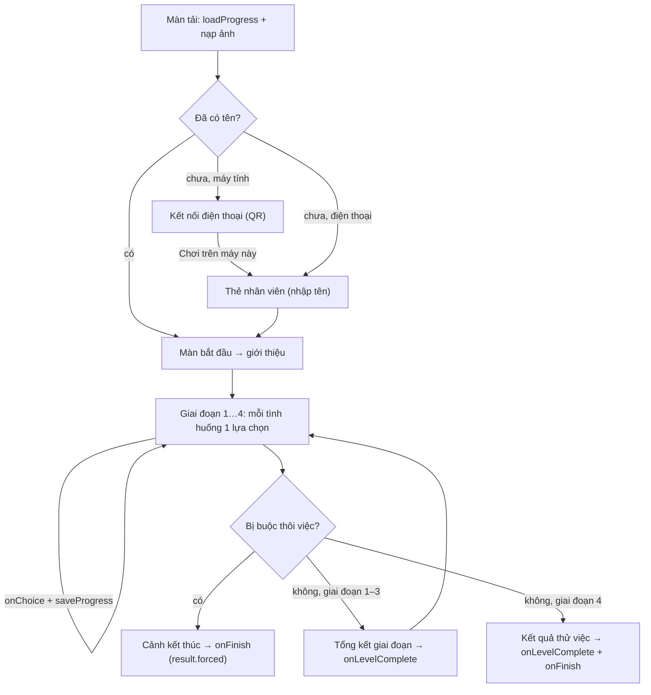

# Hướng dẫn tích hợp game RoleCraft PM60 vào web khác

Tài liệu dành cho lập trình viên web chủ (frontend + backend) muốn đưa game **RoleCraft – PM 60 ngày thử việc** vào hệ thống của mình: cổng đào tạo, LMS, trang nội bộ.

Tóm tắt cách hoạt động:

- Game là một **module React**. Web chủ gắn component `<RoleCraftGame />` (hoặc gọi `mountRoleCraft()` nếu không viết bằng React), game mở ra **phủ toàn màn hình**, người chơi bấm **Thoát** thì web chủ gỡ component.
- Game chạy trong **Shadow DOM**: CSS và id của game không ảnh hưởng web chủ, và ngược lại.
- Game **không tự gọi API**. Dữ liệu vào qua props (tên người chơi, tiến độ đã lưu), dữ liệu ra qua callback (lựa chọn, kết quả giai đoạn, kết quả cuối, tiến độ cần lưu). Web chủ gọi backend bằng công cụ và token đăng nhập của chính mình.

Mục lục: [1. Yêu cầu](#1-yêu-cầu) · [2. Lấy gói nhúng](#2-lấy-gói-nhúng) · [3. Phục vụ thư mục ảnh](#3-phục-vụ-thư-mục-ảnh) · [4. Gắn game (React)](#4-gắn-game-vào-trang-react) · [5. Web không dùng React](#5-web-chủ-không-dùng-react) · [6. Props](#6-props) · [7. Luồng chơi và thời điểm sự kiện](#7-luồng-chơi-và-thời-điểm-sự-kiện) · [8. Lưu tiến độ trên server](#8-lưu-tiến-độ-trên-server) · [9. Dữ liệu sự kiện](#9-dữ-liệu-sự-kiện) · [10. Gợi ý backend](#10-gợi-ý-backend) · [11. Lưu ý kỹ thuật](#11-lưu-ý-kỹ-thuật) · [12. Kiểm tra trước khi phát hành](#12-kiểm-tra-trước-khi-phát-hành) · [13. Xử lý sự cố](#13-xử-lý-sự-cố)

---

## 1. Yêu cầu

| Hạng mục | Yêu cầu |
|---|---|
| React | `react` và `react-dom` **bản 18 trở lên**, do web chủ cung cấp (gói nhúng không kèm React). |
| Trình duyệt | Safari 16.4+, Chrome 111+, Firefox 128+ (giới hạn của Tailwind 4). |
| Thẻ viewport | `<meta name="viewport" content="width=device-width, initial-scale=1, viewport-fit=cover">`. Thiếu `viewport-fit=cover` thì iPhone không báo vùng an toàn (tai thỏ, thanh home). |
| Phục vụ file tĩnh | Khoảng **60 MB** ảnh (thư mục `assets/`), xem [mục 3](#3-phục-vụ-thư-mục-ảnh). |

## 2. Lấy gói nhúng

Trong repo game (Node 24):

```bash
npm install
npm run build:embed
```

Kết quả ở `dist/embed/`:

| File | Nội dung |
|---|---|
| `rolecraft-game.js` | Module ES, khoảng 490 KB (gzip khoảng 160 KB). Đã gồm CSS và font. Không gồm React. |
| `rolecraft-game.js.map` | Source map (tuỳ chọn, để gỡ lỗi). |
| `types/index.d.ts` | Khai báo TypeScript: `RoleCraftGameProps`, `MountOptions`, `RoleCraftHandle`, `GameState`, `ChoiceEvent`, `LevelCompleteEvent`, `FinishReport`. |
| `assets/` | Ảnh game nạp lúc chạy: `bg/` (nền), `ui/` (khung, nút, con trỏ, huy hiệu), `characters/` (NPC), `sheets/` (nhân vật PM). |

Có hai cách đưa vào web chủ.

**Cách A – chép thư mục (đơn giản nhất).** Chép `dist/embed/` vào web chủ, ví dụ `src/vendor/rolecraft/` (phần JS) và thư mục file tĩnh `public/rolecraft/assets/` (phần ảnh):

```tsx
import { RoleCraftGame } from './vendor/rolecraft/rolecraft-game.js';
import type { FinishReport } from './vendor/rolecraft/types/index.d.ts';
```

**Cách B – gói npm nội bộ.** Gói có tên `rolecraft-pm`, khai báo `exports` và `types` trỏ vào `dist/embed/`. Gói để `private` nên không đẩy lên npm công khai; đóng thành file `.tgz` hoặc đưa lên registry nội bộ:

```bash
# trong repo game
npm run build:embed && npm pack            # -> rolecraft-pm-0.1.0.tgz
# trong web chủ
npm install ../rolecraft_pm/rolecraft-pm-0.1.0.tgz
```

```tsx
import { RoleCraftGame, type FinishReport } from 'rolecraft-pm';
```

Với cách B, thư mục ảnh nằm ở `node_modules/rolecraft-pm/dist/embed/assets/`; web chủ cần chép nó sang thư mục file tĩnh trong bước build (script `postinstall`, hoặc plugin chép file của bundler).

## 3. Phục vụ thư mục ảnh

Web chủ phục vụ nguyên thư mục `assets/` và truyền URL của nó qua prop `assetBase`, ví dụ `assetBase="/rolecraft/assets/"` hoặc URL CDN `https://cdn.example.com/rolecraft/0.1.0/assets/` (dấu `/` cuối có thể bỏ, game tự thêm).

- Game nạp ảnh bằng ``, CSS `url()` và vẽ lên canvas nhưng **không đọc điểm ảnh**, nên ảnh để ở domain khác (CDN) không cần cấu hình CORS.
- Tên file ảnh **không có mã băm**. Nếu đặt cache dài hạn, hãy đưa số phiên bản vào đường dẫn (`/rolecraft/0.1.0/assets/`) và đổi đường dẫn khi cập nhật game.
- Game chỉ tải ảnh khi cần: màn tải nạp trước khoảng 6 ảnh, nền từng cảnh nạp theo hướng màn hình (`_pc` hoặc `_mobile`) khi vào giai đoạn chơi.

## 4. Gắn game vào trang React

Gắn component = mở game (phủ toàn màn hình); gỡ component = đóng game. Tối thiểu:

```tsx
import { useState } from 'react';
import { RoleCraftGame } from 'rolecraft-pm';

export function TrainingPage() {
  const [open, setOpen] = useState(false);
  return (
    <>
      <button onClick={() => setOpen(true)}>Chơi PM 60 ngày</button>
      {open && <RoleCraftGame assetBase="/rolecraft/assets/" onExit={() => setOpen(false)} />}
    </>
  );
}
```

Đầy đủ, nối backend theo người dùng đăng nhập:

```tsx
import { useState } from 'react';
import { RoleCraftGame, type GameState } from 'rolecraft-pm';
import { api } from './api';                       // axios/fetch của web chủ, đã kèm token

export function TrainingPage({ user }: { user: { id: string; fullName: string } }) {
  const [open, setOpen] = useState(false);
  return (
    <>
      <button onClick={() => setOpen(true)}>Chơi PM 60 ngày</button>
      {open && (
        <RoleCraftGame
          assetBase="/rolecraft/assets/"
          storageKey={`rolecraft.${user.id}`}
          player={{ name: user.fullName }}
          loadProgress={() => api.get<GameState | null>(`/rolecraft/progress`).then(r => r.data)}
          saveProgress={state => api.put('/rolecraft/progress', state)}
          onChoice={e => api.post('/rolecraft/choices', e)}
          onLevelComplete={e => api.post('/rolecraft/levels', e)}
          onFinish={report => api.post('/rolecraft/results', report)}
          onExit={() => setOpen(false)}
        />
      )}
    </>
  );
}
```

Ghi chú:

- Callback đổi lúc nào cũng được, game không khởi động lại. Game **chỉ gắn lại từ đầu** khi `assetBase`, `storageKey`, `player.name`, `zIndex` hoặc `lockScroll` đổi giá trị.
- `StrictMode` không gây vấn đề (game tự xử lý việc gắn, gỡ, gắn lại).
- Mỗi trang chỉ có **một** game. Mở game thứ hai thì game đang mở tự đóng.

## 5. Web chủ không dùng React

Dùng hàm `mountRoleCraft(phầnTử, tuỳChọn)`. Tuỳ chọn giống props ở [mục 6](#6-props).

```js
import { mountRoleCraft } from 'rolecraft-pm';

const holder = document.getElementById('rolecraft');     // phần tử bất kỳ; game phủ toàn màn hình
document.getElementById('playBtn').onclick = () => {
  const game = mountRoleCraft(holder, {
    assetBase: '/rolecraft/assets/',
    onExit: () => game.destroy(),
  });
};
```

`mountRoleCraft` trả về `{ update(props), destroy() }`. `update` đổi callback hoặc props mà không khởi động lại game.

Trang vẫn phải nạp được `react`, `react-dom/client` và `react/jsx-runtime`, vì module import ba tên này:

- Có bundler (Vite, webpack…): cài `react`, `react-dom` bằng npm, bundler tự gộp.
- Không có bundler: khai báo `<script type="importmap">` trỏ ba tên trên tới **cùng một bản React** (tự host hoặc CDN ESM), đặt trước thẻ `<script type="module">` của trang.

## 6. Props

Mọi prop đều tuỳ chọn. Kiểu đầy đủ: `RoleCraftGameProps` / `MountOptions` trong `types/index.d.ts`.

| Prop | Kiểu | Mặc định | Ý nghĩa |
|---|---|---|---|
| `assetBase` | `string` | thư mục cạnh trang | URL thư mục ảnh ([mục 3](#3-phục-vụ-thư-mục-ảnh)). |
| `player` | `{ name?: string }` | – | Tên người chơi từ tài khoản. Có tên hợp lệ thì thẻ nhân viên in sẵn tên, người chơi không phải nhập và không sửa được. Tên hợp lệ: 2–24 ký tự, chỉ chữ cái (có dấu) và khoảng trắng; game tự viết hoa chữ đầu mỗi từ. Tên không hợp lệ (có số, ký hiệu…) thì người chơi tự nhập. |
| `storageKey` | `string` | `rolecraft.pm60.session` | Khoá `localStorage` giữ bản sao tiến độ trên máy. **Nên đặt theo người dùng** (`rolecraft.<userId>`) để hai tài khoản dùng chung máy không thấy tiến độ của nhau. |
| `loadProgress` | `() => GameState \| null \| Promise<…>` | – | Nạp tiến độ từ server, gọi một lần trong màn tải. Trả về dữ liệu thì dùng thay bản `localStorage`; trả `null` hoặc lỗi thì dùng bản `localStorage`. |
| `saveProgress` | `(state: GameState) => unknown` | – | Gọi mỗi lần game lưu ([mục 8](#8-lưu-tiến-độ-trên-server)). |
| `onChoice` | `(e: ChoiceEvent) => void` | – | Sau mỗi lựa chọn trong tình huống. |
| `onLevelComplete` | `(e: LevelCompleteEvent) => void` | – | Khi xong một giai đoạn. |
| `onFinish` | `(report: FinishReport) => void` | – | Khi có kết quả thử việc (hết 60 ngày hoặc bị buộc thôi việc giữa chừng). |
| `qrUrl` | `string \| false` | trang hiện tại | Link trong mã QR của màn **Kết nối điện thoại** (xem [mục 7](#7-luồng-chơi-và-thời-điểm-sự-kiện)). Link cố định, mỗi lần quét máy chủ tự sinh phiên. `false` = bỏ màn này. |
| `presenter` | `boolean` | `false` | Hiện **màn trình chiếu** thay cho game (xem [mục Màn trình chiếu](#màn-trình-chiếu)). Web chủ tự kiểm tra quyền admin trước khi bật. |
| `liveUrl` | `string` | – | Máy chủ realtime của màn trình chiếu (`wss://…/live` hoặc đường dẫn `/live`). Có → game báo trạng thái người chơi lên máy chủ. Màn trình chiếu mặc định `/live`. |
| `onExit` | `() => void` | – | Có prop này thì game hiện nút **Thoát** (thanh trên màn giới thiệu và bảng tạm dừng). Web chủ đóng game trong hàm này. Không truyền thì không có nút Thoát. |
| `zIndex` | `number` | `2147483000` | Lớp phủ của game. |
| `lockScroll` | `boolean` | `true` | Khoá cuộn trang chủ khi đang chơi, trả lại khi đóng. |
| `className`, `style` | | – | Chỉ `<RoleCraftGame>`: gắn lên phần tử giữ chỗ (game vẫn phủ toàn màn hình). |

## 7. Luồng chơi và thời điểm sự kiện

Chiến dịch gồm **4 giai đoạn (level), 16 tình huống**, mỗi tình huống 3 lựa chọn A/B/C. Người chơi có thể dừng giữa chừng và chơi tiếp sau.



| Thời điểm | Sự kiện |
|---|---|
| Mở game | `loadProgress()` (một lần) |
| Nhập tên, bắt đầu ván mới, đầu mỗi giai đoạn, sau mỗi lựa chọn, cuối mỗi giai đoạn, khi có kết quả | `saveProgress(state)` |
| Sau mỗi lựa chọn | `onChoice(e)` |
| Xong tổng kết giai đoạn 1, 2, 3 | `onLevelComplete(e)` với `tier` và `summary` |
| Xong giai đoạn 4 | `onLevelComplete(e)` với `tier = null`, `summary = null`, rồi `onFinish(report)` |
| Bị buộc thôi việc giữa chừng | `onFinish(report)` với `report.result.forced` (**không** có `onLevelComplete` cho giai đoạn dở) |
| Người chơi bấm Thoát | `onExit()` |

**Kết nối điện thoại.** Trên máy tính (có chuột), người chơi mới thấy màn QR trước màn nhận thẻ: quét mã bằng điện thoại để dùng điện thoại làm tay cầm, màn hình máy tính chuyển động theo. Phần đồng bộ realtime giữa điện thoại và máy tính **chưa có** (cần máy chủ realtime); hiện tại quét mã chỉ mở link `qrUrl` trên điện thoại, còn máy tính chơi tiếp bằng nút **Chơi trên máy này**. Điện thoại và máy tính bảng (màn cảm ứng) không thấy màn này.

**Buộc thôi việc** (game dừng ngay, kết quả `FAIL`): quỹ dự án dưới 20.000.000 VND hoặc rủi ro đạt 100% sau một lựa chọn; tiến độ dưới 18/60 ngày ở mốc cuối giai đoạn 2, 3, 4. Chi tiết: `docs/KICH_BAN_ROLECRAFT_PM60.md` mục 9.

**Sự kiện có thể lặp lại.** Bảng tạm dừng (nút ⏸ góc phải hoặc phím Esc) có:

- **Chơi lại màn này**: quay về đầu giai đoạn hiện tại. `onChoice` của các tình huống trong giai đoạn đó, `onLevelComplete` và `onFinish` sẽ được gọi lại.
- **Về trang chủ**: về màn bắt đầu, giữ tiến độ.
- **Xoá dữ liệu chơi**: xoá toàn bộ tiến độ (tên từ `player` vẫn giữ). Game gọi `saveProgress` với trạng thái gần như rỗng; server cần chấp nhận và ghi đè.
- **Thoát** (khi có `onExit`).

Thẻ cuối cũng có nút chơi lại giai đoạn cuối hoặc chơi lại từ đầu. Vì vậy backend nên coi mỗi `onFinish` là **một lượt kết quả** (lưu lịch sử, hoặc giữ lượt tốt nhất / mới nhất), không giả định mỗi người chỉ có một kết quả.

## 8. Lưu tiến độ trên server

`GameState` là một object JSON:

```ts
interface GameState {
  playerName?: string;
  game?: { level: string; run: Run } | null;   // level đang chơi + toàn bộ trạng thái ván
  hudTourDone?: boolean;                       // đã xem hướng dẫn chỉ số
}
```

- **Lưu nguyên văn**, không sửa bên trong: cấu trúc `run` có thể đổi giữa các phiên bản game. Cột JSON (PostgreSQL `jsonb`, MySQL `JSON`) theo người dùng là đủ. Kích thước khoảng **25–30 KB** khi đã chơi hết (gồm điểm lưu đầu mỗi giai đoạn cho nút "Chơi lại màn này").
- **Ghi đè, bản mới nhất thắng.** `saveProgress` luôn gửi toàn bộ trạng thái (không gửi phần thay đổi). Nếu yêu cầu có thể đến server lệch thứ tự, hãy bỏ qua bản cũ (ví dụ so thời điểm gửi, hoặc xếp hàng các yêu cầu phía client).
- **Lỗi lưu không làm dừng game.** Game không chờ và không thử lại; nếu cần, web chủ tự thử lại trong `saveProgress`. Game luôn giữ một bản trong `localStorage` (theo `storageKey`), nên người chơi mở lại trên cùng máy vẫn tiếp tục được.
- **Nhiều thiết bị.** Lúc mở game, dữ liệu từ `loadProgress` thay bản `localStorage`, nên người chơi đổi máy vẫn chơi tiếp từ bản trên server.
- `loadProgress` nên trả về nhanh: màn tải chờ hàm này xong. Lỗi hoặc `null` thì game dùng bản trên máy.

## 9. Dữ liệu sự kiện

### Đơn vị chỉ số (`metrics`, `changes`)

Các chỉ số lưu ở đơn vị nội bộ; đổi ra số thực tế như bảng dưới (game hiển thị theo cách này).

| Khoá | Tên | Đơn vị lưu | Đổi ra số thực tế | Đầu game |
|---|---|---|---|---|
| `budget` | Quỹ dự án | triệu VND | × 1.000.000 VND (có thể âm khi vượt ngân sách) | 100 |
| `project_progress` | Tiến độ | 0–100 | × 0,6 = số ngày đã làm xong / 60 | 40 (24/60 ngày) |
| `product_quality` | Chất lượng | % | | 60 |
| `project_risk` | Rủi ro dự án | % (cao là xấu) | | 10 |
| `team_morale` | Tinh thần đội ngũ | % | | 70 |
| `client_trust` | Niềm tin khách hàng | % | | 60 |
| `management_trust` | Niềm tin quản lý | % | | 50 |

`changes` là mảng `{ key, from, to }` các chỉ số vừa đổi.

### `onChoice(e: ChoiceEvent)`

```json
{
  "level": 1, "levelId": "P1_STARTUP",
  "scenario": "P1_S01_PROJECT_TAKEOVER", "no": "S01", "title": "Team mới, deadline cũ", "day": 1,
  "choice": "A", "label": "Review toàn bộ dự án",
  "outcome": null,
  "changes": [
    { "key": "project_progress", "from": 40, "to": 35 }, { "key": "product_quality", "from": 60, "to": 75 },
    { "key": "management_trust", "from": 50, "to": 55 }, { "key": "project_risk", "from": 10, "to": 5 }
  ],
  "metrics": { "budget": 100, "project_progress": 35, "product_quality": 75, "project_risk": 5, "team_morale": 70, "client_trust": 60, "management_trust": 55 },
  "flags": { "project_reviewed": true }
}
```

- `outcome`: vài lựa chọn có kết quả rẽ nhánh theo lịch sử ván chơi (ví dụ S07 C → `"C1"` hoặc `"C2"`); còn lại là `null`.
- `flags`: các cờ lịch sử quyết định đã bật (ý nghĩa: `docs/KICH_BAN_ROLECRAFT_PM60.md` mục 3).

### `onLevelComplete(e: LevelCompleteEvent)`

```jsonc
{
  "level": 1, "levelId": "P1_STARTUP",
  "tier": { "id": "caution", "label": "Cần thận trọng", "mood": "mid" },   // xếp loại giai đoạn; mood: good | mid | bad
  "summary": {
    "tier": { … },
    "decisions": [{ "no": "S01", "title": "…", "choice": "A", "label": "…", "avg": 2.5 }],   // avg: điểm năng lực 0–3
    "best": { "no": "S02", "title": "…", "choice": "C", "label": "…", "avg": 3 },
    "topCompetency": { "code": "RISK", "label": "Quản trị rủi ro và chất lượng", "score": 100 },
    "competencies": [{ "code": "SCOPE", "label": "…", "score": 75 }],                      // chỉ năng lực có trong giai đoạn
    "changes": [{ "key": "budget", "from": 100, "to": 85 }],                               // đủ 7 chỉ số: đầu → cuối giai đoạn
    "budgetUsed": 15,
    "dangers": ["…"], "returned": [{ "at": "…", "from": "L1 · S03 · A", "text": "…" }], "facts": { … }
  },
  "metrics": { … }
}
```

Giai đoạn 4 (cuối) gửi `tier = null`, `summary = null`; kết quả nằm ở `onFinish`.

### `onFinish(report: FinishReport)`

```jsonc
{
  "player": "Nguyễn Khánh An",
  "result": {
    "code": "PASS_EXCELLENT",            // PASS_EXCELLENT | PASS | EXTEND_PROBATION | FAIL
    "label": "Pass xuất sắc",            // bị buộc thôi việc: "Buộc thôi việc"
    "title": "PASS XUẤT SẮC – SẴN SÀNG CHO PHẠM VI LỚN HƠN",
    "mood": "good",                      // good | mid | bad
    "reasons": [],                       // lý do ngắn khi Gia hạn / Không đạt
    "critical": [], "hardFails": [],
    "forced": { "code": "EXIT_RISK_OUT_OF_CONTROL", "label": "Rủi ro mất kiểm soát", "day": 22 }   // chỉ có khi bị buộc thôi việc
  },
  "competencies": [                      // 6 năng lực, score 0–100 (null nếu chưa gặp tình huống nào của năng lực đó)
    { "code": "SCOPE", "label": "Quản trị phạm vi và thay đổi", "score": 75 },
    { "code": "RESOURCE", "label": "Quản trị nguồn lực và ngân sách", "score": 80 },
    { "code": "RISK", "label": "Quản trị rủi ro và chất lượng", "score": 86 },
    { "code": "PEOPLE", "label": "Lãnh đạo và phát triển đội ngũ", "score": 83 },
    { "code": "STAKEHOLDER", "label": "Giao tiếp với khách hàng và quản lý", "score": 88 },
    { "code": "DECISION", "label": "Ra quyết định và chịu trách nhiệm", "score": 92 }
  ],
  "decisions": [{ "level": 1, "id": "P1_S01_PROJECT_TAKEOVER", "no": "S01", "title": "Team mới, deadline cũ",
                  "choice": "A", "label": "Review toàn bộ dự án", "result": "…", "avg": 2.5 }],   // mọi tình huống đã chơi
  "best": [ … ], "worst": [ … ],         // 3 quyết định điểm cao nhất / thấp nhất (cùng dạng decisions)
  "learning": [{ "code": "SCOPE", "label": "…", "score": 75, "text": "Quản lý phạm vi: …" }],   // 2 năng lực yếu nhất + gợi ý học
  "links": [{ "from": "S03 · A", "to": "S05", "text": "…" }],                                // quyết định cũ → hậu quả về sau
  "changes": [{ "key": "budget", "from": 100, "to": 80 }],                                   // 7 chỉ số: ngày 1 → ngày kết thúc
  "text": "…"                            // báo cáo dạng chữ (giống file người chơi tải về)
}
```

Ý nghĩa kết quả:

| `result.code` | Hiển thị | Ghi chú |
|---|---|---|
| `PASS_EXCELLENT` | Pass xuất sắc | |
| `PASS` | Pass – trở thành PM chính thức | |
| `EXTEND_PROBATION` | Gia hạn thử việc | |
| `FAIL` | Không đạt thử việc | Có `result.forced` khi bị buộc thôi việc: `EXIT_BUDGET_DEPLETED` (cạn quỹ), `EXIT_RISK_OUT_OF_CONTROL` (rủi ro mất kiểm soát), `EXIT_CONTRACT_CANCELLED` (khách hàng huỷ hợp đồng) |

Điều kiện chi tiết của từng kết quả: `docs/KICH_BAN_ROLECRAFT_PM60.md` mục 9.

### Mã giai đoạn và tình huống

| Giai đoạn | `levelId` | Ngày | Tình huống (`no` · `scenario`) |
|---|---|---|---|
| 1 · Khởi động | `P1_STARTUP` | 1–15 | S01 `P1_S01_PROJECT_TAKEOVER` · S02 `P1_S02_SENIOR_AUTONOMY` · S03 `P1_S03_SCOPE_CHANGE` · S04 `P1_S04_TOOL_BUDGET` |
| 2 · Hòa nhập | `P2_INTEGRATION` | 16–30 | S05 `P2_S05_DUAL_DEADLINE` · S06 `P2_S06_DEADLINE_QUALITY` · S07 `P2_S07_KEY_PERSON_RETENTION` · S08 `P2_S08_CUSTOMER_COMPLAINT` |
| 3 · Bứt phá | `P3_BREAKTHROUGH` | 31–45 | S09 `P3_S09_PRODUCTION_INCIDENT` · S10 `P3_S10_SALES_OVERCOMMIT` · S11 `P3_S11_JUNIOR_MISTAKE` · S12 `P3_S12_BIG_PROJECT` |
| 4 · Thu hoạch | `P4_HARVEST` | 46–60 | S13 `P4_S13_OPERATING_SYSTEM` · S14 `P4_S14_TEAM_DEVELOPMENT` · S15 `P4_S15_CLIENT_EXPANSION` · S16 `P4_S16_FINAL_REVIEW` |

## 10. Gợi ý backend

Game không quy định API; dưới đây là một cách tổ chức đủ dùng cho LMS.

| Endpoint | Gọi từ | Lưu |
|---|---|---|
| `GET /rolecraft/progress` | `loadProgress` | Trả `GameState` của người dùng, hoặc `null`. |
| `PUT /rolecraft/progress` | `saveProgress` | Ghi đè `GameState` (JSON) theo người dùng. |
| `POST /rolecraft/choices` | `onChoice` | Nhật ký lựa chọn: `user_id, scenario, choice, outcome, day, metrics, created_at`. Dùng cho thống kê "bao nhiêu % chọn A ở S06". |
| `POST /rolecraft/levels` | `onLevelComplete` | Kết quả giai đoạn: `user_id, level_id, tier_id, metrics, created_at`. |
| `POST /rolecraft/results` | `onFinish` | Lượt kết quả: `user_id, code, forced_code, forced_day, competencies (6 điểm), report (JSON đầy đủ), created_at`. |

- **Không tin dữ liệu từ client** cho các mục đích có hệ quả (chấm điểm chính thức, cấp chứng nhận): mọi sự kiện đều phát ra từ trình duyệt và người dùng có thể sửa. Nếu cần, đối chiếu chuỗi `onChoice` với kết quả, hoặc chỉ dùng số liệu cho mục đích đào tạo và tham khảo.
- Lựa chọn và kết quả có thể lặp lại khi người chơi chơi lại ([mục 7](#7-luồng-chơi-và-thời-điểm-sự-kiện)): lưu theo lượt (thêm `created_at`), không đặt ràng buộc duy nhất theo `(user_id, scenario)`.

## Màn trình chiếu

Màn cho admin chiếu lên màn lớn trong buổi đào tạo: **mã QR cố định** (link game, prop `qrUrl`) và **danh sách người chơi realtime**: đang chơi (ở sảnh hoặc giai đoạn/ngày), hoàn thành (kèm kết quả), đã rời, cùng dòng hoạt động gần đây. Người chơi chơi độc lập; màn này chỉ để xem.

```tsx
{/* trang admin của web chủ (đã kiểm tra quyền) */}
<RoleCraftGame presenter assetBase="/rolecraft/assets/" liveUrl="wss://game.example.com/live" qrUrl="https://game.example.com/rolecraft" onExit={close} />

{/* trang người chơi: thêm liveUrl để báo trạng thái lên màn trình chiếu */}
<RoleCraftGame assetBase="/rolecraft/assets/" liveUrl="wss://game.example.com/live" onExit={close} />
```

- Cần máy chủ realtime (WebSocket) do BE làm theo [BE_REALTIME_TRINH_CHIEU.md](BE_REALTIME_TRINH_CHIEU.md). Khi phát triển, `npm run dev` gắn sẵn máy chủ giả lập ở `/live`; trang game riêng mở màn trình chiếu bằng `/#admin`.
- Mất kết nối không ảnh hưởng việc chơi; game tự nối lại. Danh sách chỉ để theo dõi, không dùng để chấm điểm (kết quả chính thức: `onFinish`).

## 11. Lưu ý kỹ thuật

- **Cỡ chữ gốc.** Cỡ chữ trong game tính theo `rem`, tức theo `font-size` của `<html>` trang chủ (Shadow DOM không cô lập được giá trị này). Trang chủ đổi `html { font-size }` khác 16px thì chữ và khung trong game to/nhỏ theo.
- **Style toàn cục.** `@font-face` và `@property` chỉ có tác dụng ở cấp document, nên module thêm một thẻ `<style id="rolecraft-global">` vào `<head>` (chỉ chứa font VT323 và khai báo biến CSS, không đổi giao diện trang chủ). Thẻ giữ lại sau khi đóng game để mở lại nhanh.
- **Content Security Policy.** Nếu web chủ dùng CSP, cần cho phép:
  - `style-src 'unsafe-inline'`: game chèn thẻ `<style>` và dùng thuộc tính `style`.
  - `font-src data:`: font nằm sẵn trong module dạng data URI.
  - `img-src` gồm nguồn của `assetBase` (và `data:`).
- **Phím tắt.** Khi game mở, Esc mở bảng tạm dừng; Enter/Space chuyển thoại. Game chỉ nghe phím khi đang mở.
- **Tab ẩn.** Người chơi chuyển tab hoặc khoá màn hình thì game tự tạm dừng.
- **Tải báo cáo.** Nút tải báo cáo trên thẻ kết quả tạo file `.txt` ngay trên trình duyệt (không cần server).

## 12. Kiểm tra trước khi phát hành

Chạy web chủ mẫu trong repo game để so sánh:

```bash
npm run demo:embed      # build:embed rồi mở /examples/react-host/
```

`examples/react-host/` là trang React có CSS riêng, "backend" giả lập bằng `sessionStorage`, ghi nhật ký các callback ngay trên trang.

Danh sách kiểm tra trên web chủ:

- [ ] Mở game trên máy tính và điện thoại (dọc, ngang): ảnh nền, khung, nút, nhân vật hiện đủ; không lỗi 404 ảnh trong DevTools.
- [ ] iPhone có tai thỏ: HUD không bị che (thẻ viewport có `viewport-fit=cover`).
- [ ] Tên người dùng in sẵn trên thẻ nhân viên (khi truyền `player`).
- [ ] Chơi một lựa chọn → server nhận `onChoice` và `saveProgress`.
- [ ] Đóng game giữa chừng, mở lại (và mở trên máy khác) → nút **Tiếp tục** đưa về đúng tình huống.
- [ ] Xong giai đoạn 1 → server nhận `onLevelComplete`.
- [ ] Nút **Thoát** (màn giới thiệu và bảng tạm dừng) đóng game; trang chủ cuộn lại được.
- [ ] Đăng xuất, đăng nhập tài khoản khác trên cùng máy → không thấy tiến độ của tài khoản trước (`storageKey` theo người dùng).
- [ ] **Xoá dữ liệu chơi** → server nhận trạng thái rỗng; mở lại game bắt đầu từ đầu.

## 13. Xử lý sự cố

| Hiện tượng | Nguyên nhân thường gặp |
|---|---|
| Nền đen, thiếu khung/nút, con trỏ mặc định | `assetBase` sai hoặc thư mục `assets/` chưa được phục vụ. Xem tab Network: ảnh `bg/…webp`, `ui/…webp` trả 404. |
| Lỗi `Failed to resolve module specifier "react"` | Trang không cung cấp React ([mục 5](#5-web-chủ-không-dùng-react)). |
| Lỗi hook / "Invalid hook call" | Trang nạp hai bản React khác nhau (ví dụ importmap trỏ `react` và `react-dom` tới hai nguồn khác phiên bản). |
| Game khởi động lại liên tục | Một trong các prop `assetBase`, `storageKey`, `player.name`, `zIndex`, `lockScroll` đổi giá trị mỗi lần render. |
| Người chơi thấy tiến độ của người khác | `storageKey` dùng chung cho mọi người dùng trên cùng máy. |
| Mở game ở máy khác không thấy tiến độ | `loadProgress` chưa truyền, trả sai định dạng (phải là đúng object đã nhận ở `saveProgress`), hoặc lỗi mạng (game khi đó dùng bản trên máy). |
| Chữ trong game quá to hoặc quá nhỏ | `font-size` của `<html>` trang chủ khác 16px ([mục 11](#11-lưu-ý-kỹ-thuật)). |
| Không có nút Thoát | Chưa truyền `onExit`. |
| Font chữ pixel không hiện | CSP chặn `font-src data:`. |
