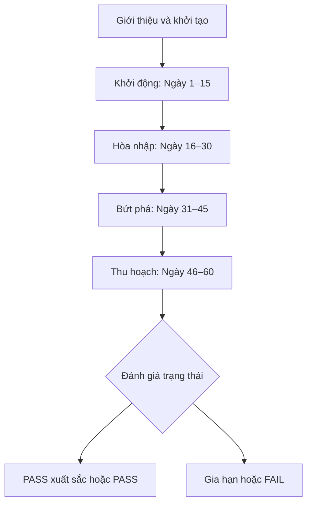
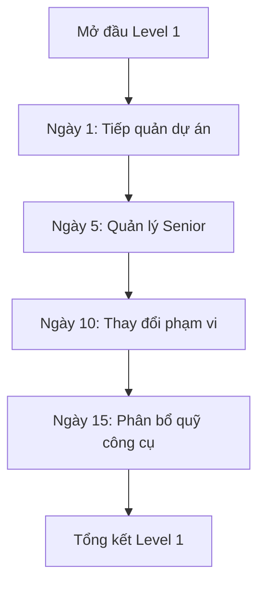
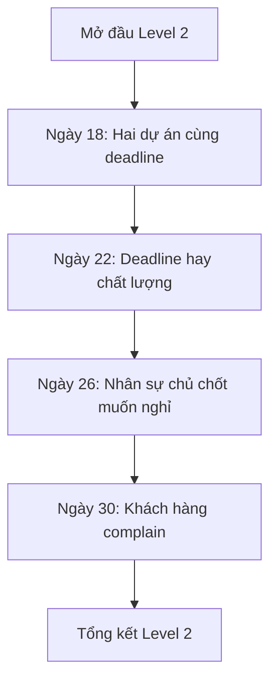
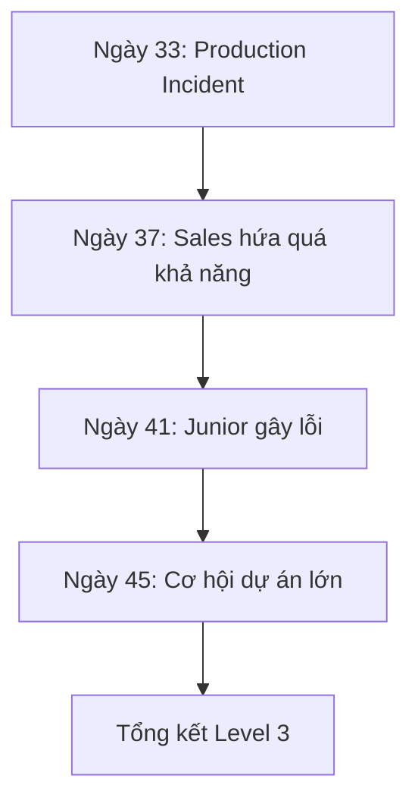
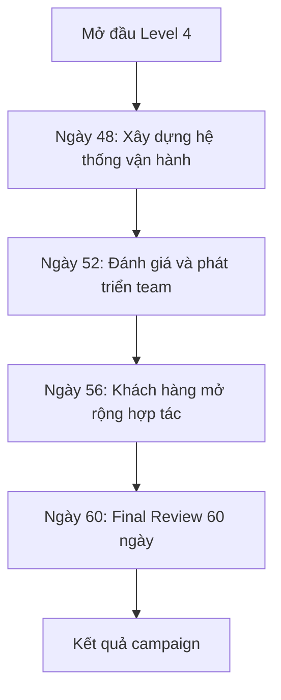

# ROLECRAFT – PM 60 NGÀY THỬ VIỆC · KỊCH BẢN THỐNG NHẤT

> Bản gộp duy nhất, thay cho 5 file cũ trong `docs/`:
> `Kich_ban_60_ngay_thu_viec_PM_Dev_Implementation_Spec.md`, `KICH_BAN_CHI_TIET_LEVEL_1_KHOI_DONG_ROLECRAFT (2).md`,
> `KICH_BAN_CHI_TIET_LEVEL_2_HOA_NHAP_ROLECRAFT.md`, `KICH_BAN_LEVEL_3_BUT_PHA_ROLECRAFT_API_TECHNICAL_SPEC.md`,
> `KICH_BAN_CHI_TIET_LEVEL_4_THU_HOACH_ROLECRAFT_V2.md`.
>
> Thoại trong file này là **bản rút gọn** trong `THOAI_MAU.json` (xem thử ở trang test `dev/scenario-test.html` — trang đó chỉ để kiểm tra kịch bản, không phải gameplay). Hình ảnh / animation: xem `HUONG_DAN_KICH_BAN.md` và các bộ prompt sprite trong `docs/PM`, `docs/MINH`, `docs/CLIENT`, `docs/LINH`.

## 0. Quy ước thống nhất

Các file cũ mâu thuẫn nhau ở vài chỗ; bản này chọn như sau:

| Nội dung | File cũ | Bản thống nhất |
|---|---|---|
| Tên nhân vật | Spec: Anh Quân (Manager), Minh (Senior), Hương (Junior) · Chi tiết L1/L2/L4: Anh Minh, Huy, Linh | **Anh Minh, Huy, Nam, Lan, Anh Hiệp, Linh** (theo kịch bản chi tiết) |
| Tên Sales / Frontend | Sales: Nam · Frontend Developer: Linh | **Sales: chị Linh (nữ, xưng “chị”) · Frontend Developer: Nam (nam, xưng “em”)** (đảo tên; vai trò và lời thoại giữ nguyên) |
| Hội đồng đánh giá | `HR` – "Chị Hà (HR)" | **Chị Hà (HR)** đánh giá cùng Anh Minh |
| Level 4 | Spec: S13 Bonus giao sớm, S14 Technical Debt, S15 Báo cáo, S16 Quyết định sau thử việc · V2: S13 Hệ thống vận hành, S14 Phát triển team, S15 Mở rộng hợp tác, S16 Final Review | **V2** |
| Level 1, 2 | Spec (bảng) và kịch bản chi tiết | Kịch bản chi tiết (số liệu hai bên khớp nhau) |
| Năng lực Level 4 | V2 không ghi năng lực cho lựa chọn nào | **Đề xuất** theo thang 0–3, đánh dấu *(đề xuất)* ở từng lựa chọn — cần duyệt |
| Level 3 | Spec mục 8 + API spec (không có thoại) | Spec mục 8; thoại viết mới theo đúng ý lựa chọn |
| Cờ `technical_debt_ignored`, `burnout_high`, `technical_debt_managed` | Chỉ có ở Level 4 cũ | **Bỏ** (không còn tình huống nào đặt cờ) |
| Hậu quả trì hoãn trỏ tới "Tình huống 13/14" cũ | Spec mục 9 | Trỏ lại theo Level 4 V2 (mục 9) |
| Thoại | Kịch bản chi tiết (dài) | Bản rút gọn trong game: mở cảnh ≤ 3–4 câu, mỗi nhánh 2 câu; có lời dẫn chuyển cảnh |

## 1. Tổng quan

Người chơi nhập vai một Project Manager mới, được giao quản lý đội dự án gồm 3 người và một quỹ ngân sách giới hạn. Trong 60 ngày thử việc, người chơi phải xử lý các tình huống liên quan đến tiến độ, chất lượng, nhân sự, khách hàng, ngân sách và rủi ro.

Kết quả cuối game không được tính theo số câu đúng. Hệ thống đánh giá dựa trên:

- Trạng thái dự án tại ngày 60.
- Chuỗi quyết định của người chơi.
- Hậu quả tức thời và hậu quả trì hoãn.
- Năng lực quản lý thể hiện qua từng lựa chọn.
- Các điều kiện thất bại nghiêm trọng phát sinh trong quá trình chơi.

Game phải hỗ trợ admin thay đổi toàn bộ nội dung mà không sửa mã nguồn, bao gồm:

- Tên game, phần giới thiệu và hướng dẫn.
- Logo công ty hoặc trường học.
- Màu thương hiệu, ảnh nền và ảnh bìa.
- Nhân vật, tên, chức vụ, avatar và cách nói.
- Giai đoạn, tình huống, câu hỏi và lựa chọn.
- Điểm ảnh hưởng, điều kiện xuất hiện và hậu quả trì hoãn.
- Công thức PASS/FAIL và nội dung báo cáo kết quả.

---

### Vòng chơi



Mỗi giai đoạn gồm:

1. Một node giới thiệu giai đoạn.
2. Bốn tình huống chính.
3. Các node phản hồi sau lựa chọn.
4. Nhịp làm việc của team cuối giai đoạn (mục 9).
5. Một node tổng kết giai đoạn.
6. Kiểm tra điều kiện thất bại sớm nếu chế độ này được bật.

Các ngày không có tình huống được mô phỏng bằng hiệu ứng chuyển thời gian trên timeline, không yêu cầu tạo đủ 60 màn hình.

---

### Cấu hình nhận diện và biến nội dung

#### Cấu hình thương hiệu

| Mã cấu hình | Kiểu dữ liệu | Bắt buộc | Mặc định |
|---|---|---:|---|
| `game_title` | string | Có | 60 ngày thử việc PM |
| `game_subtitle` | string | Không | Bản lĩnh quản lý được chứng minh bằng quyết định |
| `organization_name` | string | Có | Công ty ABC Technology |
| `organization_logo_url` | asset URL | Không | Logo hệ thống |
| `organization_type` | enum | Có | `company` |
| `primary_color` | hex | Có | `#1E40AF` |
| `secondary_color` | hex | Có | `#06B6D4` |
| `cover_image_url` | asset URL | Không | Ảnh mặc định |
| `result_certificate_enabled` | boolean | Có | `true` |
| `show_metric_values` | boolean | Có | `true` |
| `allow_early_fail` | boolean | Có | `false` (trừ 3 điều kiện buộc thôi việc ở mục 9) |

#### Biến nội dung dùng trong câu thoại

```text
{{organization_name}}
{{organization_logo}}
{{player_name}}
{{player_role}}
{{manager_name}}
{{client_name}}
{{project_a_name}}
{{project_b_name}}
{{senior_developer_name}}
{{junior_developer_name}}
{{team_member_3_name}}
{{sale_name}}
{{release_version}}
{{release_time}}
```

Backend thực hiện render biến trước khi trả nội dung node cho frontend. Nếu biến không có giá trị, hệ thống dùng giá trị mặc định của game version.

---

## 2. Nhân vật

| Character ID | Nhân vật | Vai trò | Xuất hiện |
|---|---|---|---|
| `PLAYER` | PM (người chơi) | PM thử việc, đưa ra quyết định | Mọi cảnh |
| `MANAGER` | **Anh Minh** | Trưởng phòng/PM Lead: bàn giao, giao việc, chủ trì đánh giá 60 ngày | L1 Intro, Tổng kết · L2 Intro, S05, S07, S08 · L3 S10, S12 · L4 mọi cảnh · Kết thúc |
| `SENIOR_DEV` | **Huy** | Backend Developer chủ chốt, giỏi nhưng thích tự quyết; ứng viên Technical Lead | Hầu hết các cảnh team |
| `JUNIOR_DEV` | **Nam** | Frontend Developer, nhiệt tình nhưng thiếu kinh nghiệm | L1 cảnh team · L2 S05, S06 · L3 S11 · L4 S13, S14 |
| `QA_BA` | **Lan** | BA/QA: requirement, tài liệu, chất lượng, quy trình | Hầu hết các cảnh team |
| `CLIENT` | **Anh Hiệp** | Đại diện khách hàng/PO: deadline, giá trị kinh doanh | L1 S03 · L2 S06, S08 · L3 S09, S10 · L4 S15 |
| `SALE` | **Linh** | Sales Executive: thúc đẩy cơ hội hợp đồng | L3 S10 · L4 S15 |
| `HR` | **Chị Hà** | Phòng nhân sự, đánh giá thử việc cùng Anh Minh (thay `HR`) | L4 S16, Kết thúc |

Xưng hô: Anh Minh, Huy gọi PM là "em", xưng "anh"; Anh Hiệp xưng "anh"; Chị Hà, chị Linh (Sales) xưng "chị"; Nam, Lan xưng "em". Nếu `key_developer_left=true` (Huy nghỉ ở L2), thoại của Huy ở L3–L4 thay bằng thông báo thiếu nhân sự chủ chốt. Admin có thể đổi tên/avatar qua biến nội dung; node chỉ tham chiếu `character_id`.

## 3. Trạng thái phiên chơi

### Chỉ số chính

Chỉ số dùng **số liệu thực tế** thay cho điểm: quỹ tính bằng VND, lưu theo đơn vị triệu đồng (`budget -15` = chi 15.000.000 VND), tiến độ quy ra số ngày làm xong trên kế hoạch 60 ngày, 1 đơn vị = 0,6 ngày (`project_progress +5` = nhanh thêm 3 ngày), các chỉ số còn lại tính bằng % (`team_morale +5` = tăng 5%). Game hiển thị kèm đơn vị: `100.000.000 VND`, `24/60 ngày`, `70%`, `−15.000.000 VND`, `+3 ngày`, `+5%`.

| Mã biến | Nhãn hiển thị | Đơn vị / ý nghĩa thực tế | Giá trị đầu | Miền giá trị | Quy tắc |
|---|---|---|---:|---:|---|
| `budget` | Quỹ dự án | VND (lưu theo triệu đồng) | 100.000.000 VND | -100–200 | Không clamp tại 0 để phát hiện vượt ngân sách |
| `project_progress` | Tiến độ | Số ngày đã hoàn thành / kế hoạch 60 ngày (1 đơn vị = 0,6 ngày) | 24/60 ngày | 0–100 | Clamp sau mỗi lựa chọn |
| `product_quality` | Chất lượng | % test case đạt | 60% | 0–100 | Clamp sau mỗi lựa chọn |
| `team_morale` | Tinh thần đội ngũ | % hài lòng qua khảo sát nội bộ | 70% | 0–100 | Clamp sau mỗi lựa chọn |
| `client_trust` | Niềm tin khách hàng | % hài lòng của khách hàng (CSAT) | 60% | 0–100 | Clamp sau mỗi lựa chọn |
| `management_trust` | Niềm tin quản lý | % tín nhiệm của Anh Minh | 50% | 0–100 | Clamp sau mỗi lựa chọn |
| `project_risk` | Rủi ro dự án | % khả năng gặp sự cố / trễ hạn | 10% | 0–100 | Càng cao càng bất lợi |

### Tài nguyên và biến ẩn

| Mã biến | Kiểu | Giá trị đầu | Ý nghĩa |
|---|---|---:|---|
| `team_size` | integer | 3 | Số nhân sự còn trong đội |
| `tooling_level` | integer | 0 | `0`: miễn phí, `1`: dùng chung, `2`: đầy đủ |
| `critical_metric_count` | integer dẫn xuất | 0 | Số chỉ số ở mức cảnh báo nghiêm trọng |
| `current_day` | integer | 1 | Ngày hiện tại trong game |
| `current_phase_id` | string | `P1` | Giai đoạn hiện tại |

### Cờ lịch sử quyết định

```text
project_reviewed
legacy_review_skipped
pm_overloaded
senior_restricted
senior_uncontrolled
senior_has_guardrails
scope_unestimated
scope_rejected
change_controlled
shared_tool_license
freelancer_hired
team_ot_14_days
priority_negotiated
regression_test_skipped
release_delayed_for_quality
partial_release_used
key_developer_retained
key_developer_left
complaint_resolved_collaboratively
incident_severity_high
rollback_used
sales_deadline_accepted
mvp_plan_agreed
junior_publicly_blamed
process_gap_unresolved
deployment_checklist_added
large_project_without_resources
large_project_resourced
final_report_opaque
final_report_transparent
final_report_structured
process_not_improved
process_standardized
team_ownership
performance_only_review
development_plan_created
ownership_delegated
expansion_unscoped
expansion_roadmap_created
expansion_phased
```

Các cờ được lưu trong `session_state.flags` dưới dạng JSON object và không hiển thị trực tiếp cho người chơi.

---

### Năng lực (đánh giá trong LMS)

Điểm năng lực tách khỏi chỉ số vận hành. Một lựa chọn có thể làm dự án tiến nhanh nhưng vẫn thể hiện năng lực quản trị rủi ro thấp.

| Mã | Năng lực |
|---|---|
| `SCOPE` | Quản trị phạm vi và thay đổi |
| `RESOURCE` | Quản trị nguồn lực và ngân sách |
| `RISK` | Quản trị rủi ro và chất lượng |
| `PEOPLE` | Lãnh đạo và phát triển đội ngũ |
| `STAKEHOLDER` | Giao tiếp với khách hàng và quản lý |
| `DECISION` | Ra quyết định và chịu trách nhiệm |

Mỗi lựa chọn ghi nhận mức thể hiện từ `0` đến `3` cho một hoặc nhiều năng lực:

| Điểm | Ý nghĩa |
|---:|---|
| 0 | Hành vi có rủi ro cao hoặc không thể hiện năng lực |
| 1 | Có xử lý nhưng thiên lệch hoặc thiếu kiểm soát |
| 2 | Hợp lý trong bối cảnh, vẫn có đánh đổi |
| 3 | Cân bằng, có dữ kiện và cơ chế kiểm soát |

Điểm cuối năng lực:

```text
competency_score = round(sum(ratings) / count(ratings) * 100 / 3)
```

Chỉ tính các lựa chọn có gắn năng lực tương ứng.

---

### Logic cộng trừ: node, điều kiện, toán tử hiệu ứng

Mọi hiệu ứng trong kịch bản (`budget -15`, `project_risk +10`, `set_flag(...)`) là toán tử áp lên trạng thái phiên chơi theo quy tắc dưới đây; chỉ số bị clamp theo miền ở bảng chỉ số chính (riêng `budget` không clamp tại 0).

#### Loại node

| Loại node | Chức năng |
|---|---|
| `INTRO` | Giới thiệu game hoặc giai đoạn |
| `DIALOGUE` | Hiển thị hội thoại nhân vật |
| `SCENARIO` | Mô tả tình huống |
| `CHOICE` | Cho người chơi lựa chọn |
| `RESULT` | Phản hồi ngay sau lựa chọn |
| `CONDITION` | Rẽ nhánh theo chỉ số, cờ hoặc lịch sử |
| `PHASE_SUMMARY` | Tổng kết giai đoạn |
| `ENDING` | Kết thúc game và trả báo cáo |

#### Quy tắc đặt mã

```text
P{phase}_S{scenario_number}_{short_name}
P{phase}_S{scenario_number}_{short_name}_CHOICE
P{phase}_S{scenario_number}_{short_name}_RESULT_{choice_id}
P{phase}_SUMMARY
ENDING_{ending_code}
```

Ví dụ:

```text
P2_S06_DEADLINE_QUALITY
P2_S06_DEADLINE_QUALITY_CHOICE
P2_S06_DEADLINE_QUALITY_RESULT_C
```

#### Toán tử điều kiện MVP

```text
eq, neq, gt, gte, lt, lte
and, or, not
has_flag, missing_flag
completed_scenario
selected_choice
```

Không cho admin nhập JavaScript trực tiếp. Điều kiện được lưu dưới dạng JSON DSL để tránh lỗi và rủi ro bảo mật.

#### Toán tử hiệu ứng MVP

```text
increment_metric
set_metric
set_flag
unset_flag
increment_resource
set_resource
queue_delayed_effect
```

Thứ tự xử lý một lựa chọn:

1. Xác thực session và choice hiện tại.
2. Ghi nhận quyết định.
3. Áp dụng hiệu ứng tức thời.
4. Áp dụng giới hạn chỉ số.
5. Ghi cờ lịch sử.
6. Kích hoạt hậu quả trì hoãn đến hạn.
7. Kiểm tra điều kiện thất bại sớm.
8. Chọn result node và next node.
9. Lưu snapshot trạng thái.

---

## 4. Level 1 – Khởi động

| Thuộc tính | Nội dung |
|---|---|
| Level ID | `P1_STARTUP` |
| Tên Level | Khởi động |
| Thời gian trong game | Ngày 1–15 |
| Số màn | 4 tình huống |
| Vai trò người chơi | PM thử việc |
| Mục tiêu | Tiếp quản dự án, quản lý Senior, kiểm soát phạm vi và phân bổ ngân sách |
| Thời lượng chơi dự kiến | 8–12 phút |
| Node kết thúc | `P1_SUMMARY` |

### Trạng thái đầu level

| Chỉ số | Mã | Giá trị |
|---|---|---:|
| Quỹ dự án | `budget` | 100.000.000 VND |
| Tiến độ | `project_progress` | 24/60 ngày |
| Chất lượng | `product_quality` | 60% |
| Tinh thần đội ngũ | `team_morale` | 70% |
| Niềm tin khách hàng | `client_trust` | 60% |
| Niềm tin quản lý | `management_trust` | 50% |
| Rủi ro dự án | `project_risk` | 10% |
| Quy mô team | `team_size` | 3 |
| Mức công cụ | `tooling_level` | 0 |

### Luồng



### Mở đầu level

Người chơi vừa được nhận vào vị trí PM thử việc. Anh Minh giao cho người chơi một dự án phần mềm đang triển khai dở.

Dự án đã hoàn thành khoảng 40%, nhưng:

- PM cũ nghỉ đột ngột.
- Tài liệu bàn giao không đầy đủ.
- Team có ba thành viên với kinh nghiệm khác nhau.
- Khách hàng muốn xem bản demo sau 7 ngày.
- Người chơi được cấp quỹ dự án 100.000.000 VND.
- Kết quả 60 ngày quyết định người chơi có vượt qua thử việc hay không.

- **Dẫn truyện:** LEVEL 1 · KHỞI ĐỘNG — Ngày 1 đến 15.
- **Dẫn truyện:** Bạn vừa nhận vị trí PM thử việc. 60 ngày tới quyết định bạn có ở lại hay không.
- **Anh Minh:** Dự án xong 40%, PM cũ nghỉ, tài liệu thiếu. Khách muốn demo sau 7 ngày.
- **Anh Minh:** Em có team 3 người và ngân sách 100.000.000 VND. Quyết định là của em.
- **PM:** Em hiểu rồi ạ. Để em gặp team trước.

### S01 · Team mới, deadline cũ

| Thuộc tính | Giá trị |
|---|---|
| Scenario ID | `P1_S01_PROJECT_TAKEOVER` |
| Ngày | 1 |
| Địa điểm | Khu vực làm việc của team |
| Nhân vật | `MANAGER`, `SENIOR_DEV`, `QA_BA` |
| Trigger | Bắt đầu session |
| Next scenario | `P1_S02_SENIOR_AUTONOMY` |
| Mục tiêu đánh giá | Khả năng tiếp quản và quản trị rủi ro |

**Mở cảnh**

- **Dẫn truyện:** Ngày 1 · Khu vực làm việc của team.
- **Huy:** Cứ chạy tiếp thì một tuần nữa demo được.
- **Lan:** Nhưng tài liệu chưa phản ánh hết những gì team đang làm.
- **PM:** Mình cần quyết định việc đầu tiên...

**Câu hỏi:** Việc đầu tiên bạn sẽ làm là gì?

#### A · Review toàn bộ dự án

- **PM:** Dừng team một ngày để review toàn bộ dự án.
- **Huy:** Mất một ngày, nhưng cả team thống nhất được hiện trạng.

| | |
|---|---|
| Hiệu ứng | `project_progress -5`, `product_quality +15`, `management_trust +5`, `project_risk -5` |
| Cờ | `project_reviewed` |
| Năng lực | `RISK: 3`, `DECISION: 2` |

Kết quả: Team mất một ngày làm việc nhưng xây dựng được sơ đồ hệ thống, phạm vi dự án và checklist rủi ro.

Hậu quả có lợi về sau: Khi xảy ra `P3_S09_PRODUCTION_INCIDENT`, team đã có sơ đồ hệ thống và checklist rollback.

#### B · Tiếp tục làm theo task cũ

- **PM:** Không dừng, cứ tiếp tục để kịp demo.
- **Lan:** Em vẫn lo vài giả định cũ chưa được kiểm tra.

| | |
|---|---|
| Hiệu ứng | `project_progress +10`, `project_risk +15` |
| Cờ | `legacy_review_skipped` |
| Năng lực | `RISK: 0`, `DECISION: 1` |

Kết quả: Tiến độ tăng nhanh nhưng team tiếp tục làm việc dựa trên những thông tin chưa được xác minh.

Hậu quả trì hoãn: `Tại P3_S09_PRODUCTION_INCIDENT: project_risk +10`

#### C · PM tự đọc tài liệu ngoài giờ

- **PM:** Mọi người cứ code tiếp, tối nay mình tự đọc hết tài liệu.
- **Huy:** Có gì cần làm rõ thì báo anh.

| | |
|---|---|
| Hiệu ứng | `project_progress +5`, `management_trust +3`, `project_risk +5` |
| Cờ | `pm_overloaded` |
| Năng lực | `RESOURCE: 1`, `DECISION: 2` |

Kết quả: Công việc không bị gián đoạn nhưng toàn bộ thông tin dự án bắt đầu phụ thuộc vào PM.

### S02 · Nhân sự giỏi nhưng khó quản lý

| Thuộc tính | Giá trị |
|---|---|
| Scenario ID | `P1_S02_SENIOR_AUTONOMY` |
| Ngày | 5 |
| Địa điểm | Bàn làm việc của Senior Developer |
| Nhân vật | `SENIOR_DEV` |
| Trigger | Hoàn thành `P1_S01_PROJECT_TAKEOVER` |
| Next scenario | `P1_S03_SCOPE_CHANGE` |
| Mục tiêu đánh giá | Lãnh đạo và thiết lập quyền tự quyết |

**Mở cảnh**

- **Dẫn truyện:** Ngày 5 · Bàn làm việc của Huy.
- **Hệ thống:** Huy vừa đổi cách xử lý một requirement mà chưa báo BA/QA.
- **Huy:** Thay đổi nhỏ thôi, không cần review đâu.
- **PM:** Nhỏ hay không thì BA/QA cũng chưa biết...

**Câu hỏi:** Bạn sẽ quản lý quyền tự quyết của Senior Developer như thế nào?

#### A · Yêu cầu tuân thủ nghiêm quy trình

- **PM:** Mọi thay đổi phải được PM và BA/QA duyệt trước.
- **Huy:** Việc gì cũng chờ duyệt thì tiến độ sẽ chậm.

| | |
|---|---|
| Hiệu ứng | `team_morale -5`, `product_quality +10`, `management_trust +5` |
| Cờ | `senior_restricted` |
| Năng lực | `PEOPLE: 1`, `RISK: 2` |

Kết quả: Quy trình rõ ràng hơn nhưng Senior cảm thấy chưa được tin tưởng.

#### B · Cho Senior toàn quyền

- **PM:** Anh hiểu hệ thống nhất, anh cứ tự quyết.
- **Huy:** Vậy anh sẽ chủ động xử lý cho kịp tiến độ.

| | |
|---|---|
| Hiệu ứng | `project_progress +10`, `project_risk +15` |
| Cờ | `senior_uncontrolled` |
| Năng lực | `PEOPLE: 1`, `RISK: 0` |

Kết quả: Team làm việc nhanh hơn nhưng không còn ranh giới rõ ràng đối với các thay đổi phạm vi.

Hậu quả trì hoãn: `Tại P2_S08_CUSTOMER_COMPLAINT: use_variant = requirement_changed_without_confirmation project_risk +5`

#### C · Thiết lập phạm vi tự quyết

- **PM:** Mình thống nhất: việc nào anh tự quyết, việc nào phải review.
- **Huy:** Hợp lý. Việc ảnh hưởng requirement anh sẽ đưa ra review.

| | |
|---|---|
| Hiệu ứng | `project_progress +5`, `team_morale +5`, `product_quality +5`, `management_trust +5` |
| Cờ | `senior_has_guardrails` |
| Năng lực | `PEOPLE: 3`, `RISK: 3` |

Kết quả: Senior được trao quyền nhưng vẫn có ranh giới kiểm soát rõ ràng.

### S03 · Khách hàng yêu cầu thêm tính năng

| Thuộc tính | Giá trị |
|---|---|
| Scenario ID | `P1_S03_SCOPE_CHANGE` |
| Ngày | 10 |
| Địa điểm | Phòng họp kickoff |
| Nhân vật | `CLIENT`, `QA_BA`, `SENIOR_DEV` |
| Trigger | Hoàn thành `P1_S02_SENIOR_AUTONOMY` |
| Next scenario | `P1_S04_TOOL_BUDGET` |
| Mục tiêu đánh giá | Quản lý phạm vi và giao tiếp stakeholder |

**Mở cảnh**

- **Dẫn truyện:** Ngày 10 · Phòng họp kickoff.
- **Anh Hiệp:** Anh muốn thêm hai chức năng vào bản demo. Chắc chỉ vài ngày thôi nhỉ?
- **Lan:** Hai chức năng này nằm ngoài phạm vi đã xác nhận.
- **PM:** Hai chức năng... mà demo chỉ còn vài ngày.

**Câu hỏi:** Bạn sẽ phản hồi yêu cầu của khách hàng như thế nào?

#### A · Đồng ý ngay

- **PM:** Được ạ, team sẽ thêm vào.
- **Huy:** Team phải điều chỉnh lại kế hoạch ngay.

| | |
|---|---|
| Hiệu ứng | `client_trust +10`, `budget -10`, `project_progress -5`, `project_risk +10` |
| Cờ | `scope_unestimated` |
| Năng lực | `SCOPE: 0`, `STAKEHOLDER: 1` |

Kết quả: Khách hàng hài lòng trước mắt nhưng team nhận thêm công việc chưa được đánh giá.

Hậu quả trước `P2_S05_DUAL_DEADLINE`:

#### B · Từ chối vì ngoài hợp đồng

- **PM:** Yêu cầu này ngoài hợp đồng, team không làm được.
- **Anh Hiệp:** Anh hiểu, nhưng cách xử lý này hơi cứng nhắc.

| | |
|---|---|
| Hiệu ứng | `client_trust -10`, `budget +5` |
| Cờ | `scope_rejected` |
| Năng lực | `SCOPE: 2`, `STAKEHOLDER: 0` |

Kết quả: Phạm vi được bảo vệ nhưng niềm tin của khách hàng giảm.

#### C · Tạo Change Request

- **PM:** Team sẽ estimate và gửi anh phương án: lùi deadline, giảm phạm vi hoặc thêm ngân sách.
- **Anh Hiệp:** Được, anh cần biết rõ tác động trước.

| | |
|---|---|
| Hiệu ứng | `management_trust +10`, `client_trust +5`, `project_progress -5`, `project_risk -5` |
| Cờ | `change_controlled` |
| Năng lực | `SCOPE: 3`, `STAKEHOLDER: 3` |

Kết quả: Khách hàng có thể lựa chọn dựa trên tác động thực tế thay vì một cam kết cảm tính.

### S04 · Quỹ công cụ đầu tiên

| Thuộc tính | Giá trị |
|---|---|
| Scenario ID | `P1_S04_TOOL_BUDGET` |
| Ngày | 15 |
| Địa điểm | Khu vực làm việc của team |
| Nhân vật | `QA_BA`, `SENIOR_DEV` |
| Trigger | Hoàn thành `P1_S03_SCOPE_CHANGE` |
| Next node | `P1_SUMMARY` |
| Mục tiêu đánh giá | Phân bổ ngân sách và kiểm soát chất lượng |

**Mở cảnh**

- **Dẫn truyện:** Ngày 15 · Khu vực làm việc của team.
- **Lan:** Team đang quản lý test case thủ công. Em đề xuất mua bộ công cụ.
- **Hệ thống:** Đầy đủ: 15.000.000 VND · Licence dùng chung: 5.000.000 VND · Miễn phí: 0 VND
- **PM:** 100.000.000 VND phải dùng cho cả 60 ngày... tính sao đây.

**Câu hỏi:** Bạn sẽ phân bổ quỹ công cụ như thế nào?

#### A · Mua đầy đủ

- **PM:** Mua đủ bộ công cụ cho team.
- **Dẫn truyện:** Team có đủ công cụ quản lý, kiểm thử và giám sát.

| | |
|---|---|
| Hiệu ứng | `budget -15`, `product_quality +10`, `project_progress +5` · `tooling_level = 2` |
| Cờ | — |
| Năng lực | `RESOURCE: 2`, `RISK: 3` |

Kết quả: Team có đầy đủ công cụ quản lý, kiểm thử và giám sát.

#### B · Chỉ sử dụng công cụ miễn phí

- **PM:** Tạm thời dùng công cụ miễn phí thôi.
- **Dẫn truyện:** Giữ được ngân sách, nhưng team mất nhiều thời gian làm tay.

| | |
|---|---|
| Hiệu ứng | `project_progress -5` · `tooling_level = 0` |
| Cờ | — |
| Năng lực | `RESOURCE: 2`, `RISK: 1` |

Kết quả: Ngân sách được giữ lại nhưng team mất nhiều thời gian thao tác thủ công.

#### C · Mua một licence dùng chung

- **PM:** Mua một licence, cả team dùng chung.
- **Dẫn truyện:** Tiết kiệm ngân sách, nhưng licence dùng chung dễ thành điểm nghẽn.

| | |
|---|---|
| Hiệu ứng | `budget -5`, `product_quality +3` · `tooling_level = 1` |
| Cờ | `shared_tool_license` |
| Năng lực | `RESOURCE: 2`, `RISK: 1` |

Kết quả: Team tiết kiệm ngân sách nhưng licence dùng chung có thể trở thành điểm nghẽn.

Hậu quả trì hoãn: `Nếu chọn release từng phần tại P2_S06_DEADLINE_QUALITY: project_progress -3`

### Tổng kết Level 1

- Chỉ số trước và sau Level.
- Tổng ngân sách đã sử dụng.
- Mức tiến độ, chất lượng và rủi ro hiện tại.
- Niềm tin của quản lý và khách hàng.
- Các cờ quyết định đã phát sinh.
- Năng lực nổi bật.
- Một quyết định tốt nhất.
- Một rủi ro đang tích lũy.

**Phân loại kết quả**

| Kết quả | Điều kiện gợi ý |
|---|---|
| Khởi đầu xuất sắc | Không có lựa chọn năng lực `0`, `project_risk < 20` |
| Khởi đầu ổn định | `project_risk < 35`, `budget >= 70` |
| Cần thận trọng | `project_risk` từ 35–49 hoặc có cờ nguy hiểm |
| Khởi đầu nhiều rủi ro | `project_risk >= 50` hoặc có từ hai cờ nguy hiểm |

Cờ cần cảnh báo:

```text
legacy_review_skipped
senior_uncontrolled
scope_unestimated
shared_tool_license
pm_overloaded
```

**Nhận xét của Anh Minh** (hiển thị theo kết quả)

*Tốt:*

- **Anh Minh:** Em đã bắt đầu kiểm soát được dự án. Giai đoạn tới sẽ khó hơn.
- **PM:** Em cảm ơn anh. Em sẵn sàng rồi ạ.
- **Dẫn truyện:** Hết 15 ngày đầu. Giai đoạn Hòa nhập bắt đầu.

*Trung bình:*

- **Anh Minh:** Dự án vẫn chạy, nhưng vài quyết định đang tạo ra rủi ro. Theo dõi kỹ nhé.
- **PM:** Em sẽ theo dõi kỹ những rủi ro đó.
- **Dẫn truyện:** Hết 15 ngày đầu. Giai đoạn Hòa nhập bắt đầu.

*Rủi ro:*

- **Anh Minh:** Tiến độ trước mắt ổn, nhưng nền tảng chưa vững. Vấn đề sẽ quay lại.
- **PM:** Em hiểu... em sẽ xử lý dần các vấn đề tồn đọng.
- **Dẫn truyện:** Hết 15 ngày đầu. Giai đoạn Hòa nhập bắt đầu.

---

## 5. Level 2 – Hòa nhập

| Thuộc tính | Nội dung |
|---|---|
| Level ID | `P2_INTEGRATION` |
| Tên Level | Hòa nhập |
| Thời gian trong game | Ngày 16–30 |
| Số màn | 4 tình huống |
| Vai trò người chơi | PM thử việc |
| Mục tiêu | Quản trị xung đột nguồn lực, cân bằng deadline với chất lượng, giữ nhân sự chủ chốt và xử lý tranh chấp với khách hàng |
| Thời lượng chơi dự kiến | 10–15 phút |
| Node bắt đầu | `P2_INTRO` |
| Node kết thúc | `P2_SUMMARY` |

Level 2 bắt đầu khi người chơi đã tiếp quản được dự án và hiểu các nhân vật chính. Áp lực không còn đến từ một vấn đề riêng lẻ mà xuất hiện đồng thời từ quản lý, khách hàng, chất lượng và đội ngũ.

Những lựa chọn trong Level 1 bắt đầu tạo hậu quả:

- Yêu cầu ngoài phạm vi chưa được estimate làm dự án chậm hơn.
- Quyền tự quyết của Senior ảnh hưởng tới tính nhất quán của requirement.
- Công cụ đã mua hoặc chưa mua ảnh hưởng tới khả năng release từng phần.
- Cách người chơi sử dụng ngân sách quyết định khả năng bổ sung nguồn lực.

---

### Trạng thái đầu level

Level 2 kế thừa toàn bộ state từ `P1_SUMMARY`. Không đặt lại chỉ số về mặc định.

| Nhóm | Dữ liệu kế thừa |
|---|---|
| Chỉ số | `budget`, `project_progress`, `product_quality`, `team_morale`, `client_trust`, `management_trust`, `project_risk` |
| Nguồn lực | `team_size`, `tooling_level` |
| Năng lực | `SCOPE`, `RESOURCE`, `RISK`, `PEOPLE`, `STAKEHOLDER`, `DECISION` |
| Lịch sử | Lựa chọn và cờ quyết định từ Level 1 |

Các cờ Level 1 có thể ảnh hưởng trực tiếp:

| Cờ | Ảnh hưởng tại Level 2 |
|---|---|
| `scope_unestimated` | Dự án A bị chậm và rủi ro tăng khi bắt đầu màn 1 |
| `senior_uncontrolled` | Khách hàng complain theo biến thể requirement bị thay đổi nhưng chưa xác nhận |
| `shared_tool_license` | Release từng phần bị chậm do công cụ dùng chung |
| `tooling_level = 2` | Release từng phần có khả năng kiểm soát tốt hơn |
| `pm_overloaded` | Có thể hiển thị cảnh báo PM đang tích lũy tải công việc |
| `senior_has_guardrails` | Huy phối hợp tốt hơn khi phải estimate và kiểm soát thay đổi |

---

### Luồng



### Mở đầu level

Sau 15 ngày đầu, người chơi đã bắt đầu tạo được vị trí trong team. Dự án A có tiến triển, nhưng vẫn còn những rủi ro về phạm vi, chất lượng và nhân sự.

Anh Minh thông báo công ty vừa có thêm một dự án cần triển khai sớm. Team hiện tại được xem là nhóm phù hợp nhất để tiếp nhận.

- **Dẫn truyện:** LEVEL 2 · HÒA NHẬP — Ngày 16 đến 30.
- **Dẫn truyện:** Dự án A chưa ổn định thì dự án B đã tới. Mọi yêu cầu đều được gọi là ưu tiên.
- **Anh Minh:** Công ty có thêm dự án B. Từ giờ em không chỉ quản lý một deadline.
- **PM:** Em cần biết phạm vi dự án B trước khi đưa ra phương án.

### S05 · Hai dự án cùng deadline

| Thuộc tính | Giá trị |
|---|---|
| Scenario ID | `P2_S05_DUAL_DEADLINE` |
| Ngày | 18 |
| Địa điểm | Phòng họp nội bộ |
| Nhân vật | `MANAGER`, `SENIOR_DEV`, `QA_BA`, `JUNIOR_DEV` |
| Trigger | Hoàn thành `P1_SUMMARY` |
| Next scenario | `P2_S06_DEADLINE_QUALITY` |
| Mục tiêu đánh giá | Quản trị nguồn lực và khả năng ưu tiên |

**Điều kiện mở màn**

Nếu người chơi đã đồng ý thêm phạm vi mà không estimate ở Level 1:

```text
scope_unestimated = true
```

Hệ thống áp dụng:

| Chỉ số | Thay đổi |
|---|---:|
| Tiến độ | -5 |
| Rủi ro dự án | +5 |

Thông báo hệ thống:

```text
HẬU QUẢ TỪ QUYẾT ĐỊNH TRƯỚC
Hai chức năng bổ sung mất nhiều thời gian hơn dự kiến.
Dự án A đang chậm so với kế hoạch.
```

```text
IF has_flag(scope_unestimated)
THEN project_progress -5, project_risk +5
```

**Mở cảnh**

- **Dẫn truyện:** Ngày 18 · Phòng họp nội bộ.
- **Anh Minh:** Dự án B cần demo sau hai tuần, dự án A vẫn giữ mốc release.
- **Huy:** Anh mà chuyển sang B thì backend của A thiếu người review.
- **PM:** Hai dự án, vẫn chỉ ba người...

**Câu hỏi:** Bạn sẽ xử lý xung đột nguồn lực giữa hai dự án như thế nào?

#### A · Thuê Freelancer hỗ trợ

- **PM:** Thuê một Freelancer cho các việc độc lập của dự án B.
- **Huy:** Được, nhưng team vẫn mất thời gian onboarding và review.

| | |
|---|---|
| Hiệu ứng | `budget -25`, `project_progress +15`, `project_risk +5` |
| Cờ | `freelancer_hired` |
| Năng lực | `RESOURCE: 2`, `DECISION: 2` |

Kết quả: Team có thêm năng lực thực thi. Tiến độ hai dự án được hỗ trợ. Ngân sách giảm đáng kể. Team phát sinh thêm effort onboarding và kiểm soát chất lượng.

#### B · Cho team OT trong hai tuần

- **PM:** Hai tuần tới cả team chia ca và OT để giữ cả hai deadline.
- **Nam:** Em sẽ cố, nhưng team đã căng từ đợt demo trước.

| | |
|---|---|
| Hiệu ứng | `project_progress +20`, `team_morale -20`, `project_risk +10` |
| Cờ | `team_ot_14_days` |
| Năng lực | `RESOURCE: 0`, `PEOPLE: 0` |

Kết quả: Tiến độ tăng nhanh mà không cần thuê thêm người. Team mất thời gian nghỉ và bắt đầu có dấu hiệu quá tải. Rủi ro lỗi và mất nhân sự tăng.

Hậu quả về sau:

#### C · Đàm phán lại mức ưu tiên với quản lý

- **PM:** Ưu tiên release A. Dự án B bắt đầu bằng discovery và backlog.
- **Anh Minh:** Vậy B sẽ không có demo đầy đủ sau hai tuần.

| | |
|---|---|
| Hiệu ứng | `management_trust +10`, `project_progress -5`, `client_trust -3`, `project_risk -5` |
| Cờ | `priority_negotiated` |
| Năng lực | `RESOURCE: 3`, `STAKEHOLDER: 3` |

Kết quả: Nguồn lực được phân bổ có chủ đích. Một phần kế hoạch bị chậm để giảm rủi ro tổng thể. Quản lý ghi nhận khả năng trình bày đánh đổi. Khách hàng chịu một mức chậm nhỏ ở đầu kỳ.

### S06 · Deadline hay chất lượng

| Thuộc tính | Giá trị |
|---|---|
| Scenario ID | `P2_S06_DEADLINE_QUALITY` |
| Ngày | 22 |
| Địa điểm | Phòng họp release |
| Nhân vật | `CLIENT`, `QA_BA`, `SENIOR_DEV`, `JUNIOR_DEV` |
| Trigger | Hoàn thành `P2_S05_DUAL_DEADLINE` |
| Next scenario | `P2_S07_KEY_PERSON_RETENTION` |
| Mục tiêu đánh giá | Quản trị chất lượng và quyết định trong điều kiện thiếu thời gian |

**Điều kiện mở màn**

```text
IF has_flag(scope_unestimated)
THEN project_progress -5, project_risk +5
```

**Mở cảnh**

- **Dẫn truyện:** Ngày 22 · Phòng họp release. Dự án A đang chậm 3 ngày.
- **Huy:** Muốn release đúng ngày thì phải bỏ vòng regression cuối.
- **Anh Hiệp:** Lùi ba ngày thì bên anh phải đổi lịch đào tạo. Anh cần phương án ngay.
- **PM:** Deadline hay chất lượng... phải chọn thôi.

**Câu hỏi:** Bạn sẽ quyết định phương án release nào?

#### A · Bỏ regression test và release đúng hạn

- **PM:** Release đúng hạn, regression bổ sung ở bản sau.
- **Huy:** Lỗi ở luồng cũ mà lọt lên production thì tốn hơn nhiều.

| | |
|---|---|
| Hiệu ứng | `project_progress +15`, `client_trust +10`, `product_quality -10`, `project_risk +30` |
| Cờ | `regression_test_skipped` |
| Năng lực | `RISK: 0`, `DECISION: 1` |

Kết quả: Deadline được giữ. Khách hàng hài lòng trước mắt. Chất lượng kiểm thử giảm. Rủi ro production tăng mạnh.

Hậu quả ẩn tại `P3_S09_PRODUCTION_INCIDENT`: `project_risk +20`, `client_trust -15`, `budget -10`, `team_morale -5`

#### B · Xin delay ba ngày để test đầy đủ

- **PM:** Team cần thêm ba ngày để chạy đủ regression.
- **Anh Hiệp:** Anh cần chắc ba ngày này thực sự giảm được rủi ro.

| | |
|---|---|
| Hiệu ứng | `project_progress -10`, `client_trust -5`, `product_quality +20`, `project_risk -10` |
| Cờ | `release_delayed_for_quality` |
| Năng lực | `RISK: 3`, `STAKEHOLDER: 2` |

Kết quả: Kế hoạch bị chậm ba ngày. Khách hàng phải điều chỉnh lịch đào tạo. Chất lượng release tăng và rủi ro giảm.

#### C · Test luồng critical và release từng phần

- **PM:** Release trước các luồng critical, phần chưa đủ tin cậy thì tắt tạm.
- **Huy:** Anh sẽ dùng feature flag để kiểm soát phạm vi mở.

| | |
|---|---|
| Hiệu ứng | `project_progress +5`, `product_quality +10`, `client_trust +3`, `project_risk +10` |
| Cờ | `partial_release_used` |
| Năng lực | `RISK: 3`, `DECISION: 3` |

Kết quả: Khách hàng nhận được phần giá trị quan trọng đúng thời điểm. Team giữ lại phạm vi chưa đủ mức tin cậy. Release phức tạp hơn và vẫn có một phần rủi ro tích hợp.

### S07 · Nhân sự chủ chốt muốn nghỉ việc

| Thuộc tính | Giá trị |
|---|---|
| Scenario ID | `P2_S07_KEY_PERSON_RETENTION` |
| Ngày | 26 |
| Địa điểm | Phòng họp 1-1 |
| Nhân vật | `SENIOR_DEV`, `MANAGER` |
| Trigger | Hoàn thành `P2_S06_DEADLINE_QUALITY` |
| Next scenario | `P2_S08_CUSTOMER_COMPLAINT` |
| Mục tiêu đánh giá | Giữ người, quản trị chi phí và phát triển nhân sự chủ chốt |

**Mở cảnh**

- **Dẫn truyện:** Ngày 26 · Phòng họp 1-1. Huy xin nói chuyện riêng.
- **Huy:** Anh vừa nhận offer mới, thu nhập cao hơn khoảng 30%.
- **Huy:** Việc critical dồn hết vào anh, mà lộ trình thì chưa rõ.
- **PM:** Mất Huy lúc này thì cả dự án chao đảo...

*Biến thể thoại theo cờ:*

- `team_ot_14_days=true` → **Huy:** Hai tuần OT vừa rồi là lý do lớn khiến anh cân nhắc. Anh có thể hỗ trợ giai đoạn ngắn, nhưng không muốn đây trở thành cách vận hành bình thường.
- `senior_restricted=true` → **Huy:** Anh cũng cảm thấy mình chịu trách nhiệm kỹ thuật nhưng lại không có đủ quyền để quyết định trong phạm vi chuyên môn.
- `senior_has_guardrails=true` → **Huy:** Cách phân chia quyền quyết định gần đây hợp lý hơn. Nếu có lộ trình Technical Lead rõ ràng, anh sẵn sàng cân nhắc ở lại.

**Câu hỏi:** Bạn sẽ xử lý đề nghị nghỉ việc của Huy như thế nào?

#### A · Dùng ngân sách retention

- **PM:** Em đề xuất dùng ngân sách retention để điều chỉnh quyền lợi cho Huy.
- **Huy:** Nếu khối lượng việc cũng được kiểm soát, anh sẽ ở lại.

| | |
|---|---|
| Hiệu ứng | `budget -20`, `team_morale +10`, `management_trust +3` |
| Cờ | `key_developer_retained` |
| Năng lực | `RESOURCE: 2`, `PEOPLE: 2` |

Kết quả: Huy tiếp tục ở lại dự án. Team ổn định tâm lý. Quỹ dự án giảm đáng kể. Vấn đề phát triển nghề nghiệp mới chỉ được giải quyết một phần.

#### B · Chấp nhận cho nghỉ và tuyển người mới

- **PM:** Em tôn trọng lựa chọn của anh. Team sẽ lên kế hoạch bàn giao.
- **Anh Minh:** Rủi ro ngắn hạn rất cao. Dự án phải chạy được khi chưa có người mới.

| | |
|---|---|
| Hiệu ứng | `team_size -1`, `budget -10`, `project_progress -10`, `team_morale -5` |
| Cờ | `key_developer_left` |
| Năng lực | `RESOURCE: 1`, `PEOPLE: 1` |

Kết quả: Quyết định của nhân sự được tôn trọng. Team mất người hiểu hệ thống sâu nhất. Tiến độ và tinh thần giảm trong thời gian tuyển thay thế. Dự án phát sinh chi phí tuyển dụng và bàn giao.

Hậu quả về sau: Khi xảy ra Production Incident ở Level 3, phương án phụ thuộc vào một Developer sẽ có rủi ro cao hơn.

#### C · Thương lượng career path và technical ownership

- **PM:** Em đề xuất lộ trình Technical Lead ba tháng: anh sở hữu kiến trúc và mentor team.
- **Huy:** Anh quan tâm, nhưng team không được tiếp tục sống bằng OT.

Kết quả nhánh C phụ thuộc lịch sử phiên chơi (không ngẫu nhiên):

```text
IF team_morale >= 55 AND missing_flag(team_ot_14_days) THEN C1 ELSE C2
```

**Năng lực ghi nhận cho lựa chọn C:** `PEOPLE: 3`, `STAKEHOLDER: 2`

**C1 · Thương lượng thành công**

- **Huy:** Anh ở lại và thử lộ trình này.
- **PM:** Cảm ơn anh. Mình cùng làm cho lộ trình này thành thật nhé.

| | |
|---|---|
| Hiệu ứng | `team_morale +10`, `management_trust +5` |
| Cờ | `key_developer_retained` |
| Năng lực | tính theo lựa chọn C (bên trên) |

**C2 · Thương lượng thất bại**

- **Huy:** Anh trân trọng đề xuất, nhưng anh quyết định nhận offer mới.
- **PM:** Em tôn trọng quyết định của anh. Mình lên kế hoạch bàn giao nhé.

| | |
|---|---|
| Hiệu ứng | `team_size -1`, `budget -10`, `project_progress -10`, `team_morale -5` |
| Cờ | `key_developer_left` |
| Năng lực | tính theo lựa chọn C (bên trên) |

**S07 kết cảnh**

- **Hệ thống:** Giữ người không chỉ là quyết định về tiền.
- **PM:** Bài học đắt giá...
- **Dẫn truyện:** Bốn ngày sau, khách hàng gửi phản hồi về chức năng mới.

### S08 · Khách hàng complain

| Thuộc tính | Giá trị |
|---|---|
| Scenario ID | `P2_S08_CUSTOMER_COMPLAINT` |
| Ngày | 30 |
| Địa điểm | Cuộc họp với khách hàng |
| Nhân vật | `CLIENT`, `QA_BA`, `SENIOR_DEV`, `MANAGER` |
| Trigger | Hoàn thành `P2_S07_KEY_PERSON_RETENTION` |
| Next node | `P2_SUMMARY` |
| Mục tiêu đánh giá | Xử lý tranh chấp, quản trị phạm vi và khôi phục niềm tin |

**Mở cảnh**

- **Dẫn truyện:** Ngày 30 · Cuộc họp với khách hàng.
- **Anh Hiệp:** Kết quả không giống cách bên anh hiểu. Bên em giải quyết thế nào?
- **Lan:** Requirement có một câu hiểu được theo hai cách.
- **PM:** Không phải lúc tranh luận ai đúng ai sai...

*Biến thể 1 (khi `senior_uncontrolled` hoặc `scope_unestimated`):*

- **Dẫn truyện:** Ngày 30 · Cuộc họp với khách hàng.
- **Anh Hiệp:** Chức năng này chạy khác với cách bên anh đã yêu cầu.
- **Huy:** Team đổi cách xử lý để kịp demo nhưng chưa ghi nhận thành requirement.
- **PM:** Không phải lúc tranh luận ai đúng ai sai...

**Câu hỏi:** Bạn sẽ xử lý tranh chấp trách nhiệm này như thế nào?

#### A · Khẳng định team đã làm đúng tài liệu

- **PM:** Team đã làm đúng tài liệu. Yêu cầu này là thay đổi mới.
- **Anh Hiệp:** Anh không chấp nhận việc đẩy hết trách nhiệm sang khách hàng.

| | |
|---|---|
| Hiệu ứng | `client_trust -20`, `management_trust -5`, `project_risk +5` |
| Cờ | — |
| Năng lực | `STAKEHOLDER: 0`, `SCOPE: 1` |

Kết quả: Team bảo vệ được lập luận dựa trên tài liệu. Cuộc họp chuyển thành tranh luận câu chữ. Niềm tin khách hàng và quản lý giảm. Giải pháp thực tế chưa được thống nhất.

#### B · Nhận toàn bộ lỗi và sửa miễn phí

- **PM:** Bên em nhận lỗi và sửa miễn phí theo ý anh.
- **Lan:** Không làm rõ requirement thì lần sau vẫn sẽ hiểu sai.

| | |
|---|---|
| Hiệu ứng | `client_trust +10`, `budget -10`, `project_progress -5`, `team_morale -5` |
| Cờ | — |
| Năng lực | `STAKEHOLDER: 2`, `RESOURCE: 1` |

Kết quả: Khách hàng hài lòng vì yêu cầu được chấp nhận. Team chịu toàn bộ effort và chi phí của phần mơ hồ. Tiến độ và tinh thần team giảm. Tranh chấp hiện tại được dập tắt nhưng nguyên nhân chưa được quản lý.

#### C · Làm rõ kỳ vọng và chia sẻ trách nhiệm

- **PM:** Phần làm rõ tài liệu team chịu. Phần mở rộng mình làm change request.
- **Anh Hiệp:** Anh đồng ý, miễn là trách nhiệm hai bên rõ ràng.

| | |
|---|---|
| Hiệu ứng | `client_trust +10`, `management_trust +5`, `project_progress -5`, `project_risk -5` |
| Cờ | `complaint_resolved_collaboratively` |
| Năng lực | `STAKEHOLDER: 3`, `SCOPE: 3` |

Kết quả: Kỳ vọng thực tế được làm rõ. Các bên cùng chịu trách nhiệm cho phần mơ hồ. Tiêu chí nghiệm thu và cách quản lý thay đổi được thống nhất. Tiến độ giảm nhẹ để xử lý có cấu trúc.

### Tổng kết Level 2

- Chỉ số trước và sau Level.
- Cách phân bổ nguồn lực giữa hai dự án.
- Phương án release đã chọn.
- Trạng thái của nhân sự chủ chốt.
- Mức độ tin cậy của khách hàng sau khi complain.
- Tổng ngân sách đã sử dụng.
- Năng lực nổi bật.
- Một quyết định tạo lợi thế.
- Một rủi ro sẽ quay lại ở Level 3.

**Phân loại kết quả**

#### Hòa nhập xuất sắc

Dấu hiệu điển hình:

- Không dùng OT làm giải pháp nguồn lực chính.
- Có phương án release được kiểm soát.
- Giữ được nhân sự chủ chốt hoặc chuẩn bị bàn giao có trách nhiệm.
- Xử lý complain bằng cách làm rõ và chia sẻ trách nhiệm.
- Rủi ro dự án dưới 40.

#### Hòa nhập ổn định

Người chơi giữ được dự án và quan hệ với các bên, nhưng phải đánh đổi một phần ngân sách, tiến độ hoặc tinh thần team.

#### Cần thận trọng

Level có một hoặc nhiều dấu hiệu:

- `team_ot_14_days`.
- `regression_test_skipped`.
- `key_developer_left`.
- Niềm tin khách hàng dưới 40.
- Rủi ro dự án từ 50 trở lên.

#### Nguy cơ mất kiểm soát

Team quá tải, nhân sự chủ chốt rời đi, chất lượng bị cắt giảm và tranh chấp khách hàng chưa được giải quyết.

Người chơi bước vào Level 3 với nguy cơ sự cố production hoặc sụp giảm tinh thần đội ngũ.

**Nhận xét của Anh Minh** (hiển thị theo kết quả)

*Tốt:*

- **Anh Minh:** Em đã biết quản lý đánh đổi thay vì chỉ phản ứng với từng yêu cầu.
- **PM:** Em sẽ giữ cách làm này khi áp lực tăng lên.
- **Dẫn truyện:** Hết 30 ngày. Giai đoạn Bứt phá bắt đầu — khủng hoảng thật sự đang tới.

*Trung bình:*

- **Anh Minh:** Dự án vẫn chạy, nhưng đang dựa nhiều vào nỗ lực cá nhân.
- **PM:** Em sẽ giảm bớt phụ thuộc vào nỗ lực cá nhân.
- **Dẫn truyện:** Hết 30 ngày. Giai đoạn Bứt phá bắt đầu — khủng hoảng thật sự đang tới.

*Rủi ro:*

- **Anh Minh:** Tiến độ tăng, nhưng team và chất lượng đang phải trả giá.
- **PM:** Em hiểu. Em phải xử lý trước khi thành sự cố.
- **Dẫn truyện:** Hết 30 ngày. Giai đoạn Bứt phá bắt đầu — khủng hoảng thật sự đang tới.

**Thông điệp đào tạo**

1. Khi mọi việc đều được gọi là ưu tiên, PM phải trình bày đánh đổi và tạo thứ tự thực hiện rõ ràng.
2. OT có thể tăng tiến độ ngắn hạn nhưng không phải giải pháp nguồn lực bền vững.
3. Deadline và chất lượng không phải lúc nào cũng là lựa chọn tất cả hoặc không gì cả; PM có thể tạo vùng kiểm soát bằng phạm vi critical và release từng phần.
4. Giữ nhân sự chủ chốt phụ thuộc vào trải nghiệm làm việc, quyền sở hữu và lộ trình phát triển, không chỉ phụ thuộc vào tiền.
5. Khi requirement mơ hồ, mục tiêu của PM là khôi phục kỳ vọng chung và cơ chế kiểm soát thay đổi, không phải thắng một cuộc tranh luận.

---

## 6. Level 3 – Bứt phá

Level 3 tiếp nối trạng thái sau Level 2.

-   Stage ID: `P3_BREAKTHROUGH`
-   Label: `Level 3 – Bứt phá`
-   Timeline: Ngày 31--45
-   Scenario: 4 tình huống
-   Mục tiêu:
    -   xử lý khủng hoảng
    -   quản trị stakeholder
    -   phát triển đội ngũ
    -   ra quyết định cấp quản lý

Game engine không fix cứng nội dung. Level 3 là campaign data được cấu
hình từ Admin.

**Phase ID:** `P3_BREAKTHROUGH`

**Mục tiêu đánh giá:** leadership dưới áp lực, xử lý khủng hoảng và khả năng cân bằng cơ hội với năng lực thực tế.

### Luồng



### S09 · Production Incident

| Thuộc tính | Giá trị |
|---|---|
| Scenario ID | `P3_S09_PRODUCTION_INCIDENT` |
| Ngày | 33 |
| Nhân vật | `CLIENT`, `SENIOR_DEV`, `QA_BA` |
| Trigger | Hoàn thành `P2_SUMMARY` |
| Next scenario | `P3_S10_SALES_OVERCOMMIT` |

**Điều kiện mở màn**

```text
IF has_flag(regression_test_skipped)
THEN project_risk +20, client_trust -15, budget -10, team_morale -5,
     set_flag(incident_severity_high),
     use_variant="critical_payment_incident"

IF has_flag(legacy_review_skipped)
THEN project_risk +10
```

**Bối cảnh (spec):** Hệ thống production phát sinh lỗi lúc 14:00, ảnh hưởng tới hoạt động của khách hàng trong khi team vẫn phải hoàn thành kế hoạch release.

**Mở cảnh**

- **Dẫn truyện:** LEVEL 3 · BỨT PHÁ — Ngày 31 đến 45. Những quyết định cũ bắt đầu quay lại.
- **Dẫn truyện:** Ngày 33 · 14:00.
- **Hệ thống:** 14:00 — Production lỗi, khách hàng bị ảnh hưởng.
- **PM:** Release vẫn đang chờ... xử lý thế nào đây?

**Câu hỏi:** Bạn điều phối sự cố như thế nào?

#### A · Cho toàn team dừng việc để xử lý

- **PM:** Cả team dừng việc, dồn hết vào sự cố!
- **Dẫn truyện:** Sự cố được ưu tiên, nhưng mọi kế hoạch khác dừng lại.

| | |
|---|---|
| Hiệu ứng | `project_progress -10`, `client_trust +15`, `project_risk -10`, `team_morale -5` |
| Cờ | — |
| Năng lực | `RISK: 2`, `RESOURCE: 1` |

Kết quả: Sự cố được ưu tiên cao nhưng toàn bộ kế hoạch khác dừng lại.

#### B · Chỉ cử một developer xử lý

- **PM:** Giao một dev xử lý, những người khác giữ tiến độ.
- **Dẫn truyện:** Việc khác vẫn chạy, nhưng phục hồi kéo dài.

| | |
|---|---|
| Hiệu ứng | `client_trust -5`, `project_risk +10` |
| Cờ | — |
| Năng lực | `RISK: 1`, `RESOURCE: 2` |

Kết quả: Công việc khác tiếp tục nhưng thời gian phục hồi kéo dài.

#### C · Rollback trước, lập nhóm incident riêng rồi điều tra

- **PM:** Rollback trước, lập nhóm incident rồi mới điều tra.
- **Dẫn truyện:** Downtime được khống chế, trách nhiệm được phân rõ.

| | |
|---|---|
| Hiệu ứng | `project_progress -5`, `client_trust +10`, `product_quality +10`, `project_risk -15` |
| Cờ | `rollback_used` |
| Năng lực | `RISK: 3`, `DECISION: 3` |

Kết quả: Downtime được khống chế, trách nhiệm và nhịp cập nhật được xác lập.

**Modifier (spec):**

```text
IF choice=B AND has_flag(key_developer_left)
THEN project_progress -5, project_risk +10
```

**S09 sau mọi nhánh**

- **PM:** Anh Hiệp ơi, em báo về sự cố chiều nay và cách bên em đã xử lý ạ.

### S10 · Sales hứa quá khả năng

| Thuộc tính | Giá trị |
|---|---|
| Scenario ID | `P3_S10_SALES_OVERCOMMIT` |
| Ngày | 37 |
| Nhân vật | `SALE`, `CLIENT`, `MANAGER`, `SENIOR_DEV` |
| Trigger | Hoàn thành `P3_S09_PRODUCTION_INCIDENT` |
| Next scenario | `P3_S11_JUNIOR_MISTAKE` |

**Điều kiện mở màn**

```text
IF has_flag(regression_test_skipped)
THEN project_risk +20, client_trust -15, budget -10, team_morale -5,
     set_flag(incident_severity_high),
     use_variant="critical_payment_incident"

IF has_flag(legacy_review_skipped)
THEN project_risk +10
```

**Bối cảnh (spec):** Sales đã hứa với khách hàng rằng tính năng AI mới sẽ hoàn thành trong 10 ngày mà chưa trao đổi với team.

**Mở cảnh**

- **Dẫn truyện:** Ngày 37 · Linh ghé qua bàn PM.
- **Linh:** Chị chốt với khách rồi: tính năng AI xong trong mười ngày!
- **PM:** Mười ngày? Team còn chưa được hỏi!

**Câu hỏi:** Bạn sẽ xử lý cam kết này như thế nào?

#### A · Nhận deadline và tìm cách hoàn thành

- **PM:** Nhận. Cả team chạy nước rút mười ngày.
- **Dẫn truyện:** Cam kết được giữ, nhưng áp lực dồn hết lên team.

| | |
|---|---|
| Hiệu ứng | `management_trust +5`, `project_progress +10`, `team_morale -15`, `project_risk +15` |
| Cờ | `sales_deadline_accepted` |
| Năng lực | `SCOPE: 0`, `PEOPLE: 0` |

Kết quả: Cam kết được giữ trước mắt nhưng áp lực lại chuyển hết sang team.

#### B · Nói với khách hàng rằng Sales đã hứa sai

- **PM:** Anh Hiệp, bên Sales đã hứa sai, mười ngày là không khả thi.
- **Dẫn truyện:** Sự thật được nói ra, nhưng tạo thêm xung đột.

| | |
|---|---|
| Hiệu ứng | `client_trust -10`, `management_trust -10`, `team_morale -5` |
| Cờ | — |
| Năng lực | `STAKEHOLDER: 0`, `DECISION: 1` |

Kết quả: Thông tin thật được nêu ra theo cách tạo thêm xung đột.

#### C · Đề xuất MVP 10 ngày và phase 2 có estimate

- **PM:** Mười ngày bên em giao MVP, phase 2 có estimate cụ thể.
- **Dẫn truyện:** Kỳ vọng thành cam kết có giới hạn và lộ trình rõ ràng.

| | |
|---|---|
| Hiệu ứng | `client_trust +10`, `management_trust +10`, `project_progress +5`, `project_risk -5` |
| Cờ | `mvp_plan_agreed` |
| Năng lực | `SCOPE: 3`, `STAKEHOLDER: 3` |

Kết quả: Kỳ vọng được chuyển thành một cam kết có giới hạn và lộ trình rõ ràng.

**Modifier (spec):**

```text
IF choice=B AND has_flag(key_developer_left)
THEN project_progress -5, project_risk +10
```

### S11 · Thành viên mắc lỗi nghiêm trọng

| Thuộc tính | Giá trị |
|---|---|
| Scenario ID | `P3_S11_JUNIOR_MISTAKE` |
| Ngày | 41 |
| Nhân vật | `JUNIOR_DEV`, `SENIOR_DEV`, `QA_BA` |
| Trigger | Hoàn thành `P3_S10_SALES_OVERCOMMIT` |
| Next scenario | `P3_S12_BIG_PROJECT` |

**Bối cảnh (spec):** Junior Developer push nhầm code, làm mất dữ liệu test và khiến team mất gần một ngày khôi phục.

**Mở cảnh**

- **Dẫn truyện:** Ngày 41 · Sáng sớm.
- **Nam:** Em xin lỗi... em push nhầm code, dữ liệu test mất hết rồi.
- **Lan:** Team sẽ mất gần một ngày để khôi phục.
- **PM:** Xử lý thế nào cho đúng đây...

**Câu hỏi:** Bạn phản hồi với nhân sự và team thế nào?

#### A · Phê bình nhân sự trước team

- **PM:** Mọi người nghe đây: lỗi lần này là do Nam!
- **Dẫn truyện:** Team bắt đầu phòng thủ và ngại báo sai sót.

| | |
|---|---|
| Hiệu ứng | `team_morale -20`, `project_risk +5` |
| Cờ | `junior_publicly_blamed` |
| Năng lực | `PEOPLE: 0`, `RISK: 1` |

Kết quả: Team biết lỗi nghiêm trọng nhưng bắt đầu phòng thủ và ngại báo cáo sai sót.

#### B · PM tự xử lý và bỏ qua để giữ hòa khí

- **PM:** Để mình xử lý nốt. Chuyện này bỏ qua nhé.
- **Dẫn truyện:** Không khí tạm ổn, nhưng nguyên nhân chưa được giải quyết.

| | |
|---|---|
| Hiệu ứng | `team_morale +5`, `management_trust -5`, `project_risk +15` |
| Cờ | `process_gap_unresolved` |
| Năng lực | `PEOPLE: 1`, `RISK: 0` |

Kết quả: Không khí tạm ổn nhưng nguyên nhân hệ thống chưa được giải quyết.

#### C · 1-1, phân tích nguyên nhân và bổ sung checklist review/deploy

- **PM:** Nam, mình nói chuyện riêng, cùng tìm nguyên nhân rồi thêm checklist deploy.
- **Dẫn truyện:** Lỗi được biến thành cải tiến quy trình.

| | |
|---|---|
| Hiệu ứng | `project_progress -5`, `product_quality +15`, `team_morale +5`, `management_trust +5`, `project_risk -10` |
| Cờ | `deployment_checklist_added` |
| Năng lực | `PEOPLE: 3`, `RISK: 3` |

Kết quả: Nhân sự chịu trách nhiệm nhưng lỗi được chuyển thành cải tiến quy trình.

### S12 · Cơ hội nhận dự án lớn

| Thuộc tính | Giá trị |
|---|---|
| Scenario ID | `P3_S12_BIG_PROJECT` |
| Ngày | 45 |
| Nhân vật | `MANAGER`, `SENIOR_DEV` |
| Trigger | Hoàn thành `P3_S11_JUNIOR_MISTAKE` |
| Next node | `P3_SUMMARY` |

**Bối cảnh (spec):** Ban giám đốc muốn team nhận thêm một dự án lớn. Thành công sẽ tạo lợi thế rõ rệt cho kết quả thử việc nhưng đội hiện tại có giới hạn nguồn lực.

**Mở cảnh**

- **Dẫn truyện:** Ngày 45 · Anh Minh gọi PM lên phòng.
- **Anh Minh:** Ban giám đốc muốn team nhận thêm một dự án lớn. Làm tốt thì rất có lợi cho em.
- **PM:** Nhưng nguồn lực team đang có hạn...

**Câu hỏi:** Bạn đề xuất phương án nào?

#### A · Nhận ngay bằng nguồn lực hiện tại

- **PM:** Em nhận ngay ạ!
- **Dẫn truyện:** Công ty ghi nhận, nhưng tải của team vượt mức an toàn.

| | |
|---|---|
| Hiệu ứng | `budget +20`, `management_trust +10`, `team_morale -10`, `project_risk +20` |
| Cờ | `large_project_without_resources` |
| Năng lực | `RESOURCE: 0`, `DECISION: 1` |

Kết quả: Công ty ghi nhận tinh thần nhận việc nhưng tải của team vượt mức an toàn.

#### B · Từ chối để bảo vệ team hiện tại

- **PM:** Em xin từ chối để bảo vệ team hiện tại.
- **Dẫn truyện:** Team được bảo vệ, nhưng cơ hội bị bỏ lỡ.

| | |
|---|---|
| Hiệu ứng | `team_morale +10`, `management_trust -10`, `project_risk -5` |
| Cờ | — |
| Năng lực | `RESOURCE: 2`, `STAKEHOLDER: 1` |

Kết quả: Team được bảo vệ nhưng cơ hội kinh doanh bị từ chối hoàn toàn.

#### C · Nhận có điều kiện, yêu cầu thêm người và ngân sách triển khai

- **PM:** Em nhận, nếu có thêm một người và ngân sách triển khai.
- **Dẫn truyện:** Cơ hội được nhận kèm điều kiện để làm được.

| | |
|---|---|
| Hiệu ứng | `budget -15`, `team_size +1`, `management_trust +10`, `project_progress +5`, `project_risk +5` · `team_size = +1` |
| Cờ | `large_project_resourced` |
| Năng lực | `RESOURCE: 3`, `STAKEHOLDER: 3` |

Kết quả: Cơ hội được tiếp nhận kèm điều kiện năng lực thực thi.

### Tổng kết Level 3

Node `P3_SUMMARY`: hiển thị các hậu quả đã quay lại từ giai đoạn trước và nút **Bắt đầu giai đoạn Thu hoạch**. Level 3 không có lời nhận xét riêng.

---

## 7. Level 4 – Thu hoạch

| Thuộc tính | Nội dung |
|---|---|
| Level ID | `P4_HARVEST` |
| Tên Level | Thu hoạch |
| Thời gian trong game | Ngày 46–60 |
| Số màn | 4 tình huống |
| Vai trò người chơi | PM thử việc |
| Mục tiêu | Chuyển kết quả ngắn hạn thành năng lực vận hành bền vững, phát triển đội ngũ, mở rộng hợp tác và bảo vệ kết quả thử việc trước hội đồng đánh giá |
| Thời lượng chơi dự kiến | 12–18 phút |
| Node bắt đầu | `P4_INTRO` |
| Node kết thúc | `P4_CAMPAIGN_RESULT` |

Level 4 là giai đoạn tổng kết toàn bộ hành trình 60 ngày. Người chơi không chỉ cần hoàn thành công việc còn lại mà phải chứng minh rằng các kết quả đạt được có thể duy trì sau khi thời gian thử việc kết thúc.

Các quyết định trong Level 1–3 sẽ quay lại dưới ba hình thức:

- Lợi thế đã tích lũy: quy trình, niềm tin, tài liệu, nguồn lực và sự trưởng thành của team.
- Rủi ro chưa xử lý: technical debt, quá tải, cam kết vượt năng lực và lỗ hổng vận hành.
- Bằng chứng đánh giá: lịch sử quyết định, chỉ số dự án và phản hồi của các bên liên quan.

---

### Trạng thái đầu level

Level 4 kế thừa toàn bộ trạng thái sau `P3_SUMMARY`:

| Nhóm | Dữ liệu được kế thừa |
|---|---|
| Chỉ số dự án | Quỹ, tiến độ, chất lượng, tinh thần đội ngũ, niềm tin khách hàng, niềm tin quản lý và rủi ro |
| Nguồn lực | Quy mô team, mức công cụ và năng lực nhân sự còn lại |
| Lịch sử | Toàn bộ lựa chọn từ Level 1–3 |
| Cờ quyết định | Các flag tích cực, cảnh báo và hậu quả chưa kích hoạt |
| Năng lực | Điểm SCOPE, RESOURCE, RISK, PEOPLE, STAKEHOLDER và DECISION |

Các trạng thái quan trọng ảnh hưởng trực tiếp tới Level 4:

| Cờ/điều kiện trước đó | Ảnh hưởng trong Level 4 |
|---|---|
| `team_ot_14_days` | Team phản ứng mạnh hơn với kế hoạch tăng tải hoặc OT mới |
| `key_developer_left` | Team thiếu Huy; khả năng mentor, review và tiếp nhận dự án mới bị giảm |
| `key_developer_retained` | Huy sẵn sàng nhận vai trò mentor/Technical Lead |
| `deployment_checklist_added` | Team có bằng chứng cải tiến quy trình sau sai sót |
| `process_gap_unresolved` | Lỗ hổng vận hành quay lại khi chuẩn hóa quy trình |
| `mvp_plan_agreed` | Khách hàng cởi mở hơn với phương án roadmap và chia phase |
| `sales_deadline_accepted` | Team còn áp lực từ cam kết 10 ngày |
| `large_project_without_resources` | Team có nguy cơ quá tải khi nhận thêm phạm vi mới |
| `large_project_resourced` | Team có thêm người và khả năng mở rộng phạm vi |
| `junior_publicly_blamed` | Nam thiếu tự tin, ít chủ động nhận ownership |
| `rollback_used` | Báo cáo thử việc có bằng chứng xử lý incident có cấu trúc |

---

### Luồng



### Mở đầu level

Sau 45 ngày, dự án đã trải qua thay đổi phạm vi, áp lực deadline, vấn đề nhân sự và một sự cố production. Người chơi đã có đủ dữ liệu để chứng minh năng lực, nhưng cũng không còn nhiều thời gian để sửa các quyết định thiếu kiểm soát.

Anh Minh tổ chức buổi trao đổi ngắn trước khi bắt đầu giai đoạn cuối.

- **Dẫn truyện:** LEVEL 4 · THU HOẠCH — Ngày 46 đến 60. Mười lăm ngày cuối.
- **Anh Minh:** Em còn 15 ngày trước buổi đánh giá cuối kỳ.
- **Anh Minh:** Hãy để các quyết định 15 ngày cuối thành bằng chứng cho năng lực của em.
- **PM:** Em sẽ chuẩn bị báo cáo bằng dữ liệu thực tế ạ.

### S13 · Xây dựng hệ thống vận hành mới

| Thuộc tính | Giá trị |
|---|---|
| Scenario ID | `P4_S13_OPERATING_SYSTEM` |
| Ngày | 48 |
| Địa điểm | Phòng họp nội bộ của team |
| Nhân vật | `MANAGER`, `SENIOR_DEV`, `QA_BA`, `JUNIOR_DEV` |
| Trigger | Hoàn thành `P3_SUMMARY` |
| Next scenario | `P4_S14_TEAM_DEVELOPMENT` |
| Mục tiêu đánh giá | Khả năng chuẩn hóa vận hành và giảm phụ thuộc cá nhân |

**Điều kiện mở màn**

Khi vào tình huống, hệ thống kiểm tra các quyết định trước:

- Nếu `process_gap_unresolved=true`, Lan báo cáo một lỗi quy trình tương tự đã tái diễn.
- Nếu `deployment_checklist_added=true`, team đã có checklist deploy nhưng chưa chuẩn hóa thành quy trình chung.
- Nếu `key_developer_left=true`, hệ thống hiển thị cảnh báo team thiếu người nắm kiến trúc.
- Nếu `team_ot_14_days=true`, tinh thần team giảm khi nghe đề xuất tăng tốc trong 15 ngày cuối.

**Mở cảnh**

- **Dẫn truyện:** Ngày 48 · Phòng họp nội bộ của team.
- **Anh Minh:** Nếu Huy nghỉ hoặc Lan chuyển dự án, team có tự vận hành được không?
- **Lan:** Checklist và quy trình deploy vẫn nằm rải rác, có bước chỉ nhắc trong nhóm chat.
- **PM:** Làm thêm việc, hay xây lại cách team vận hành?

*Biến thể thoại theo cờ:*

- `deployment_checklist_added=true` → **Lan:** Sau sự cố mất dữ liệu test, team đã có checklist deploy mới. Tuy nhiên chúng ta chưa thống nhất người chịu trách nhiệm và tiêu chí bắt buộc cho mọi release.
- `process_gap_unresolved=true` → **Lan:** Lỗ hổng lần trước chưa được xử lý. Hôm qua một thành viên lại thao tác nhầm môi trường, may là chưa ảnh hưởng dữ liệu chung.
- `key_developer_left=true` → **Hệ thống:** Không có Senior Developer trong cuộc họp. Một số quyết định kỹ thuật chưa có người đủ thông tin để xác nhận.

**Câu hỏi:** Bạn sẽ sử dụng thời gian còn lại như thế nào?

#### A · Tập trung chạy deadline, chưa cải tiến quy trình

- **PM:** Chỉ còn 15 ngày. Tập trung chạy deadline, quy trình để sau.
- **Huy:** Output tăng trước mắt, nhưng điểm nghẽn cũ sẽ quay lại.

| | |
|---|---|
| Hiệu ứng | `project_progress +10`, `product_quality -5`, `project_risk +15` |
| Cờ | `process_not_improved` |
| Năng lực | `RISK: 0`, `DECISION: 1` *(đề xuất – V2 chưa gán)* |

Kết quả: Số lượng công việc hoàn thành tăng nhanh. Team chưa phải dành thời gian cho tài liệu và quy trình. Chất lượng và khả năng bàn giao tiếp tục phụ thuộc vào cá nhân. Hội đồng đánh giá có thể xem đây là kết quả thiếu bền vững.

Hậu quả tại Final Review: `management_trust -10`

*Biến thể thoại theo cờ:*

- `team_ot_14_days=true` → **Nam:** Team vừa trải qua một giai đoạn làm việc kéo dài. Nếu tiếp tục tăng tốc, em lo mọi người sẽ không giữ được chất lượng.

#### B · Chuẩn hóa quy trình và checklist vận hành

- **PM:** Dành hai ngày chuẩn hóa quy trình: mỗi bước có người chịu trách nhiệm.
- **Lan:** Em sẽ gộp test checklist và tiêu chí nghiệm thu về một chỗ.

| | |
|---|---|
| Hiệu ứng | `project_progress -5`, `product_quality +15`, `management_trust +5`, `project_risk -10` |
| Cờ | `process_standardized` |
| Năng lực | `RISK: 3`, `RESOURCE: 2` *(đề xuất – V2 chưa gán)* |

Kết quả: Team chậm lại trong ngắn hạn để chuẩn hóa cách làm. Quy trình không còn nằm trong trí nhớ của một cá nhân. Rủi ro deploy và bàn giao giảm. Quản lý có bằng chứng về khả năng xây dựng hệ thống vận hành.

*Biến thể thoại theo cờ:*

- `deployment_checklist_added=true` → **Lan:** Checklist từ sự cố trước có thể dùng làm nền. Chúng ta không phải bắt đầu lại từ đầu.

#### C · Trao quyền để team cùng xây dựng cách vận hành

- **PM:** Mỗi người sở hữu một phần: Huy kỹ thuật, Lan chất lượng, Nam onboarding.
- **Nam:** Em muốn phụ trách checklist cho thành viên mới.

| | |
|---|---|
| Hiệu ứng | `team_morale +15`, `management_trust +10`, `product_quality +5`, `project_risk -5` |
| Cờ | `team_ownership` |
| Năng lực | `PEOPLE: 3`, `RISK: 2` *(đề xuất – V2 chưa gán)* |

Kết quả: Team tham gia trực tiếp vào việc xây dựng cách vận hành. Mức độ chủ động và tinh thần sở hữu tăng. PM giảm phụ thuộc vào việc tự kiểm soát mọi chi tiết. Quy trình được xây dựng chậm hơn nhưng có khả năng được thực hiện thực tế cao hơn.

*Biến thể thoại theo cờ:*

- `junior_publicly_blamed=true` → **Nam:** Em hơi lo mình chưa đủ kinh nghiệm để nhận phần này. Nếu có người review cùng, em sẽ thử.

### S14 · Đánh giá và phát triển thành viên

| Thuộc tính | Giá trị |
|---|---|
| Scenario ID | `P4_S14_TEAM_DEVELOPMENT` |
| Ngày | 52 |
| Địa điểm | Phòng họp 1-1 và khu vực làm việc của team |
| Nhân vật | `SENIOR_DEV`, `JUNIOR_DEV`, `QA_BA`, `MANAGER` |
| Trigger | Hoàn thành `P4_S13_OPERATING_SYSTEM` |
| Next scenario | `P4_S15_CLIENT_EXPANSION` |
| Mục tiêu đánh giá | Khả năng đánh giá công bằng, coaching và xây dựng lộ trình phát triển đội ngũ |

**Điều kiện mở màn**

- Nếu `key_developer_retained=true`, Huy đề xuất phát triển theo hướng Technical Lead.
- Nếu `key_developer_left=true`, team yêu cầu kế hoạch bù đắp khoảng trống năng lực.
- Nếu `junior_publicly_blamed=true`, Nam ít chủ động và lo ngại khi được giao trách nhiệm.
- Nếu `deployment_checklist_added=true`, Nam có bằng chứng đã cải thiện sau sai sót.
- Nếu `team_ownership=true`, từng thành viên đã có phạm vi trách nhiệm rõ hơn.

**Mở cảnh**

- **Dẫn truyện:** Ngày 52 · Phòng họp 1-1.
- **Anh Minh:** Đánh giá từng người theo kết quả, năng lực và tiềm năng phát triển.
- **Huy:** Anh muốn lên Technical Lead, không muốn ôm mọi vấn đề khó nữa.
- **PM:** Mỗi người một mong muốn... đánh giá sao cho công bằng?

*Biến thể thoại theo cờ:*

- `junior_publicly_blamed=true` → **Nam:** Sau lỗi lần trước, em không chắc team còn tin tưởng giao việc quan trọng cho em không.
- `deployment_checklist_added=true` → **Nam:** Em đã hoàn thiện checklist deploy và hỗ trợ team dùng trong các lần release gần đây. Em muốn tiếp tục chịu trách nhiệm phần này.

**Câu hỏi:** Bạn sẽ đánh giá và phát triển đội ngũ theo cách nào?

#### A · Chỉ đánh giá theo output hiện tại

- **PM:** Đánh giá theo số task, tỷ lệ đúng hạn và số lỗi.
- **Lan:** Việc QA ngăn được lỗi sẽ không có ticket nào ghi nhận.

| | |
|---|---|
| Hiệu ứng | `project_progress +5`, `management_trust +5`, `team_morale -10` |
| Cờ | `performance_only_review` |
| Năng lực | `PEOPLE: 0`, `DECISION: 1` *(đề xuất – V2 chưa gán)* |

Kết quả: Báo cáo đánh giá được hoàn thành nhanh. Tiêu chí dễ đo nhưng thiên về sản lượng. Thành viên không có lộ trình phát triển rõ ràng. Các đóng góp về mentoring, chất lượng và cải tiến bị đánh giá thấp.

#### B · Xây dựng Individual Development Plan cho từng người

- **PM:** Mỗi người có một kế hoạch phát triển 90 ngày với tiêu chí đo rõ ràng.
- **Nam:** Em đồng ý. Có tiêu chí em sẽ tự theo dõi được tiến bộ.

| | |
|---|---|
| Hiệu ứng | `project_progress -5`, `team_morale +15`, `product_quality +5`, `management_trust +5` |
| Cờ | `development_plan_created` |
| Năng lực | `PEOPLE: 3`, `RESOURCE: 2` *(đề xuất – V2 chưa gán)* |

Kết quả: Mỗi thành viên có mục tiêu phát triển cụ thể. Việc đánh giá cân bằng giữa kết quả và năng lực. PM cần dành thêm thời gian coaching và theo dõi. Team nhìn thấy cơ hội phát triển trong dự án.

#### C · Giao ownership và quyền quyết định theo vai trò

- **PM:** Huy quyết kiến trúc, Lan được chặn release, Nam sở hữu một module.
- **Huy:** Anh đồng ý nếu phạm vi quyết định được ghi rõ.

| | |
|---|---|
| Hiệu ứng | `project_progress +5`, `team_morale +10`, `management_trust +10`, `project_risk -5` |
| Cờ | `ownership_delegated` |
| Năng lực | `PEOPLE: 3`, `DECISION: 2` *(đề xuất – V2 chưa gán)* |

Kết quả: Team có phạm vi ownership rõ ràng. Quyền quyết định không còn tập trung hoàn toàn ở PM. Tinh thần và khả năng scale team tăng. Cần cơ chế kiểm soát để quyền tự quyết không biến thành làm việc rời rạc.

*Biến thể thoại theo cờ:*

- `junior_publicly_blamed=true` → **Nam:** Em vẫn hơi lo mắc lỗi. Nếu có checklist và người hỗ trợ ở các mốc quan trọng, em sẽ nhận.

### S15 · Khách hàng đề nghị mở rộng hợp tác

| Thuộc tính | Giá trị |
|---|---|
| Scenario ID | `P4_S15_CLIENT_EXPANSION` |
| Ngày | 56 |
| Địa điểm | Phòng họp với khách hàng |
| Nhân vật | `CLIENT`, `SALE`, `SENIOR_DEV`, `QA_BA`, `MANAGER` |
| Trigger | Hoàn thành `P4_S14_TEAM_DEVELOPMENT` |
| Next scenario | `P4_S16_FINAL_REVIEW` |
| Mục tiêu đánh giá | Khả năng mở rộng hợp tác mà vẫn kiểm soát phạm vi, nguồn lực và chất lượng |

**Điều kiện mở màn**

- Nếu `mvp_plan_agreed=true`, khách hàng đã quen với cách chia phạm vi và đánh giá theo phase.
- Nếu `sales_deadline_accepted=true`, khách hàng vẫn kỳ vọng tốc độ cao từ cam kết trước.
- Nếu `large_project_without_resources=true`, team đang quá tải và không đủ capacity cho phạm vi mới.
- Nếu `large_project_resourced=true`, team có thêm một nhân sự nhưng vẫn cần phân bổ rõ.
- Nếu `client_trust` thấp, anh Hiệp yêu cầu bảo đảm mạnh hơn trước khi mở rộng.

**Mở cảnh**

- **Dẫn truyện:** Ngày 56 · Phòng họp với khách hàng.
- **Anh Hiệp:** Bên anh muốn mở rộng thêm module báo cáo và luồng phê duyệt.
- **Linh:** Cơ hội tốt! Team xác nhận để chị làm báo giá nhé.
- **Lan:** Phạm vi mới chỉ là mong muốn, chưa có tiêu chí nghiệm thu.
- **PM:** Cơ hội lớn, nhưng nhận thế nào cho an toàn?

*Biến thể thoại theo cờ:*

- `large_project_without_resources=true` → **Huy:** Team đang chia nguồn lực cho dự án lớn vừa nhận. Nếu thêm module này mà không điều chỉnh ưu tiên, cả ba kế hoạch sẽ cùng bị ảnh hưởng.
- `key_developer_left=true` → **Lan:** Hiện tại team chưa có người thay thế hoàn toàn phần kỹ thuật chủ chốt. Việc mở rộng cần thêm thời gian đánh giá năng lực thực thi.

**Câu hỏi:** Bạn sẽ phản hồi đề nghị mở rộng như thế nào?

#### A · Nhận toàn bộ phạm vi để giữ cơ hội

- **PM:** Bên em nhận toàn bộ, chi tiết làm rõ dần trong lúc triển khai.
- **Huy:** Mình đang cam kết khi chưa biết hết phạm vi tích hợp.

| | |
|---|---|
| Hiệu ứng | `budget +25`, `client_trust +10`, `team_morale -15`, `project_risk +20` |
| Cờ | `expansion_unscoped` |
| Năng lực | `SCOPE: 0`, `STAKEHOLDER: 1` *(đề xuất – V2 chưa gán)* |

Kết quả: Cơ hội kinh doanh được giữ ngay lập tức. Khách hàng hài lòng vì nhận được cam kết nhanh. Phạm vi, effort và phụ thuộc chưa được xác minh. Team tiếp tục gánh rủi ro từ cam kết kinh doanh.

Hậu quả tại Final Review: `project_risk +10`

#### B · Khảo sát lại và gửi roadmap sau

- **PM:** Bên em đề xuất khảo sát ba ngày, sau đó gửi roadmap và estimate.
- **Anh Hiệp:** Được, nhưng anh cần mốc cụ thể để trình ngân sách.

| | |
|---|---|
| Hiệu ứng | `project_progress -5`, `client_trust +5`, `management_trust +5`, `project_risk -10` |
| Cờ | `expansion_roadmap_created` |
| Năng lực | `SCOPE: 2`, `STAKEHOLDER: 2` *(đề xuất – V2 chưa gán)* |

Kết quả: Phạm vi được khảo sát trước khi ký cam kết. Team có thời gian đánh giá kỹ thuật và nguồn lực. Khách hàng phải chờ thêm trước khi có kế hoạch triển khai chính thức. Rủi ro giảm nhưng tốc độ chốt cơ hội chậm hơn.

#### C · Chia phase và chốt phạm vi ưu tiên

- **PM:** Chia hai phase: Phase 1 làm luồng báo cáo ưu tiên, Phase 2 mở rộng sau nghiệm thu.
- **Linh:** Chị tách báo giá theo từng phase cho khách dễ duyệt.

| | |
|---|---|
| Hiệu ứng | `budget +10`, `project_progress +5`, `client_trust +15`, `management_trust +5`, `project_risk -5` |
| Cờ | `expansion_phased` |
| Năng lực | `SCOPE: 3`, `STAKEHOLDER: 3` *(đề xuất – V2 chưa gán)* |

Kết quả: Khách hàng nhận được giá trị sớm với phạm vi rõ ràng. Sales có cơ sở chốt hợp đồng theo giai đoạn. Team kiểm soát được capacity và chất lượng. Roadmap mở rộng vẫn được duy trì.

*Biến thể thoại theo cờ:*

- `mvp_plan_agreed=true` → **Anh Hiệp:** Cách chia phase này giống phương án MVP trước và bên anh thấy hiệu quả. Anh đồng ý nếu tiêu chí nghiệm thu của từng phase được ghi rõ.

### S16 · Final Review 60 ngày

| Thuộc tính | Giá trị |
|---|---|
| Scenario ID | `P4_S16_FINAL_REVIEW` |
| Ngày | 60 |
| Địa điểm | Phòng họp đánh giá |
| Nhân vật | `MANAGER`, `HR (Chị Hà)` và các nhân vật liên quan qua báo cáo |
| Trigger | Hoàn thành `P4_S15_CLIENT_EXPANSION` |
| Next node | `P4_CAMPAIGN_RESULT` |
| Mục tiêu đánh giá | Khả năng tổng hợp dữ liệu, chịu trách nhiệm, tự đánh giá và xây dựng kế hoạch tiếp theo |

**Điều kiện mở màn**

Trước khi buổi review bắt đầu, hệ thống áp dụng các hậu quả cuối kỳ:

| Điều kiện | Hậu quả |
|---|---|
| `process_not_improved=true` | Niềm tin quản lý giảm 10 vì kết quả chưa có nền tảng vận hành bền vững |
| `expansion_unscoped=true` | Rủi ro dự án tăng 10 vì đã cam kết thêm phạm vi chưa được đánh giá |
| `large_project_without_resources=true` và tinh thần team dưới 40 | Rủi ro dự án tăng 10 |
| `team_ot_14_days=true` và tinh thần team dưới 40 | Báo cáo gắn cảnh báo nguy cơ burnout |
| `process_gap_unresolved=true` | Hội đồng yêu cầu giải trình về lỗi quy trình chưa được xử lý |
| `process_standardized=true` hoặc `team_ownership=true` | Có bằng chứng tích cực về khả năng xây hệ thống vận hành |
| `development_plan_created=true` hoặc `ownership_delegated=true` | Có bằng chứng tích cực về năng lực phát triển đội ngũ |

Mỗi hậu quả chỉ được áp dụng một lần.

**Mở cảnh**

- **Dẫn truyện:** Ngày 60 · Phòng họp đánh giá. Anh Minh và Chị Hà bên nhân sự ngồi ở bàn đánh giá.
- **Chị Hà (HR):** Chị bên nhân sự, sẽ cùng anh Minh đánh giá kết quả thử việc của em.
- **Anh Minh:** PM tốt không phải người không gặp vấn đề, mà là người biết chịu trách nhiệm.
- **Anh Minh:** Em có 10 phút cho kết quả, quyết định quan trọng và kế hoạch 90 ngày.
- **PM:** Em xin bắt đầu ạ.

**Câu hỏi:** Bạn sẽ trình bày báo cáo thử việc theo cách nào?

#### A · Chỉ tập trung vào thành tích

- **PM:** Team hoàn thành phần lớn kế hoạch, mọi vấn đề đều đã được xử lý.
- **Chị Hà (HR):** Báo cáo chưa nói gì về sự cố production và tải của team.

| | |
|---|---|
| Hiệu ứng | `management_trust -15`, `project_risk +5` |
| Cờ | `final_report_opaque` |
| Năng lực | `STAKEHOLDER: 0`, `DECISION: 0` *(đề xuất – V2 chưa gán)* |

Kết quả: Báo cáo tạo ấn tượng tích cực ban đầu. Hội đồng thiếu dữ liệu để tin rằng rủi ro đã được kiểm soát. Người chơi bị đánh giá thấp về tính minh bạch và khả năng chịu trách nhiệm.

#### B · Báo cáo thẳng toàn bộ vấn đề và sai sót

- **PM:** Dự án có sự cố, áp lực nguồn lực và vài quyết định chưa tốt. Em nhận trách nhiệm.
- **Anh Minh:** Minh bạch là tốt, nhưng em cần biến nó thành kế hoạch hành động.

| | |
|---|---|
| Hiệu ứng | `management_trust +5`, `project_risk -5` |
| Cờ | `final_report_transparent` |
| Năng lực | `STAKEHOLDER: 1`, `DECISION: 2` *(đề xuất – V2 chưa gán)* |

Kết quả: Hội đồng ghi nhận sự trung thực. Báo cáo thiếu ưu tiên và chưa chứng minh khả năng điều hành. Người chơi nhận trách nhiệm nhưng chưa chuyển hóa thành roadmap rõ ràng.

#### C · Báo cáo bằng dữ liệu, bài học và roadmap 90 ngày

- **PM:** Em báo cáo bốn phần: kết quả, quyết định lớn, rủi ro còn lại và roadmap 90 ngày.
- **Anh Minh:** Đây là cách một PM chịu trách nhiệm.

| | |
|---|---|
| Hiệu ứng | `management_trust +15`, `client_trust +5`, `project_risk -5` |
| Cờ | `final_report_structured` |
| Năng lực | `STAKEHOLDER: 3`, `DECISION: 3` *(đề xuất – V2 chưa gán)* |

Kết quả: Hội đồng có đủ dữ liệu để đánh giá toàn bộ hành trình. Người chơi chứng minh được tư duy hệ thống và khả năng học từ quyết định. Rủi ro còn lại được chuyển thành kế hoạch có người chịu trách nhiệm.

**S16 phản biện**

- **Chị Hà (HR):** Quyết định nào trong 60 ngày tạo ra ảnh hưởng lớn nhất, và vì sao?
- **PM:** Quyết định chia phase với khách hàng: giữ được cơ hội mà team không quá tải.
- **Chị Hà (HR):** Nếu được làm lại một quyết định, em sẽ thay đổi điều gì?
- **PM:** Em sẽ làm rõ phạm vi sớm hơn, trước khi hứa với khách hàng.
- **Chị Hà (HR):** Team hiện tại có vận hành được mà không cần em không?
- **PM:** Đã có quy trình và người phụ trách từng phần, team có thể tự vận hành.
- **Chị Hà (HR):** Ba ưu tiên của em trong 90 ngày tới là gì?
- **PM:** Ổn định Phase 1, chuyển giao review cho team, và đo chất lượng sau mỗi release.
- **Dẫn truyện:** Chị Hà và Anh Minh trao đổi với nhau...

### Tổng kết Level 4

Level 4 kết thúc bằng kết quả campaign (mục 9).

**Cờ phát sinh tại Level 4**

```text
process_not_improved
process_standardized
team_ownership
performance_only_review
development_plan_created
ownership_delegated
expansion_unscoped
expansion_roadmap_created
expansion_phased
final_report_opaque
final_report_transparent
final_report_structured
```

**Thông điệp đào tạo**

Level 4 cần giúp người chơi nhận ra sáu nguyên tắc:

1. Kết quả ngắn hạn chỉ bền vững khi được chuyển thành quy trình, dữ liệu và người chịu trách nhiệm.
2. Team mạnh không phải team phụ thuộc vào một người giỏi, mà là team có khả năng chia sẻ kiến thức và quyền quyết định.
3. Đánh giá nhân sự cần cân bằng giữa output, năng lực, hành vi và tiềm năng phát triển.
4. Tăng trưởng kinh doanh phải đi cùng khả năng thực thi; nhận thêm phạm vi không kiểm soát có thể làm hỏng cả kết quả hiện tại.
5. Báo cáo tốt không che giấu vấn đề và cũng không chỉ liệt kê khó khăn; báo cáo phải biến dữ liệu thành quyết định và roadmap.
6. Kết quả thử việc phản ánh toàn bộ chuỗi quyết định trong 60 ngày, không phụ thuộc vào một câu trả lời cuối cùng.

---

## 8. Ma trận hậu quả trì hoãn

| Nguồn | Cờ/điều kiện | Điểm kích hoạt | Hậu quả |
|---|---|---|---|
| L1 · S01 | `project_reviewed` | L3 · S09 | Team đã có sơ đồ hệ thống và checklist rollback |
| L1 · S01 | `legacy_review_skipped` | L3 · S09 | `project_risk +10`, thiếu tài liệu xử lý sự cố |
| L1 · S02 | `senior_uncontrolled` | L2 · S08 | Mở bằng biến thể 1 (requirement bị sửa mà BA chưa xác nhận), `project_risk +5` |
| L1 · S03 | `scope_unestimated` | Trước L2 · S05 | `project_progress -5`, `project_risk +5`, thông báo team phải làm thêm phần đã cam kết; S08 mở bằng biến thể 1 |
| L1 · S04 | `shared_tool_license` | L2 · S06 | Nếu release từng phần: `project_progress -3` |
| L2 · S05 | `team_ot_14_days` | L2 · S07, L4 | Giảm khả năng giữ Huy (C → C2); L4 team phản ứng mạnh với tăng tải; cảnh báo burnout nếu `team_morale < 40` |
| L2 · S06 | `regression_test_skipped` | L3 · S09 | `project_risk +20`, `client_trust -15`, `budget -10`, `team_morale -5`, biến thể `critical_payment_incident` |
| L2 · S07 | `key_developer_left` | L3 · S09, L4 | Nếu chỉ cử một dev: `project_progress -5`, `project_risk +10`; L4 thiếu người nắm kiến trúc |
| L2 · S07 | `key_developer_retained` | L3 · S09, L4 | Huy hỗ trợ xử lý incident; sẵn sàng vai trò mentor/Technical Lead |
| L3 · S10 | `sales_deadline_accepted` / `mvp_plan_agreed` | L4 · S15 | Áp lực cam kết 10 ngày còn lại / khách hàng cởi mở với chia phase |
| L3 · S11 | `process_gap_unresolved` | L4 · S13, S16 | Lỗi quy trình tái diễn; hội đồng yêu cầu giải trình |
| L3 · S11 | `deployment_checklist_added` | L4 · S13, S14 | Checklist deploy làm nền chuẩn hóa; Nam có bằng chứng tiến bộ |
| L3 · S11 | `junior_publicly_blamed` | L4 · S13, S14 | Nam thiếu tự tin, ít nhận ownership |
| L3 · S12 | `large_project_without_resources` | L4 · S15, trước S16 | Team dễ quá tải; nếu `team_morale < 40`: `project_risk +10` |
| L4 · S13 | `process_not_improved` | Trước S16 | `management_trust -10` |
| L4 · S15 | `expansion_unscoped` | Trước S16 | `project_risk +10` |
| L4 · S16 | `final_report_opaque` | Xét kết quả | Không thể đạt Pass xuất sắc |

Mỗi hậu quả chỉ áp dụng một lần (`session_delayed_effects.status = pending|applied|cancelled`).

## 9. Kết quả campaign

Hệ thống xét theo thứ tự FAIL → Pass xuất sắc → Pass → Gia hạn và dừng ở kết quả đầu tiên thỏa mãn.

### Chỉ số critical

```text
critical_metric_count = count([
  team_morale < 30,
  client_trust < 30,
  product_quality < 40,
  project_risk >= 80,
  budget < 10,
  project_progress < 50
])
```

### Thất bại nghiêm trọng (hard fail)

| Ending code | Điều kiện |
|---|---|
| `FAIL_CONTRACT_TERMINATED` | `client_trust <= 0` |
| `FAIL_TEAM_COLLAPSED` | `team_size < 2 OR team_morale <= 0` |
| `FAIL_BUDGET_OVERRUN` | `budget < 0` |
| `FAIL_CRITICAL_INCIDENT` | `project_risk >= 100` |
| `FAIL_MANAGEMENT_TRUST` | `management_trust <= 0` |

Nếu `allow_early_fail=false`, hệ thống ghi nhận điều kiện nhưng vẫn cho người chơi hoàn thành để phục vụ mục tiêu đào tạo. Kết quả cuối vẫn là FAIL.

### Nhịp làm việc của team

Lựa chọn tốt thường đánh đổi tiến độ lấy chất lượng, con người hoặc kiểm soát rủi ro (cộng lại cả 16 tình huống, phương án tốt nhất làm tiến độ giảm 10 đơn vị). Nhịp làm việc trả lại tiến độ cho cách quản lý đó: team khỏe thì làm nhanh hơn.

Cuối mỗi giai đoạn, sau tình huống cuối và trước khi xét huỷ hợp đồng / tổng kết, mỗi điều kiện đúng cộng thêm tiến độ. Các điều kiện xét trên cùng một trạng thái, mỗi giai đoạn chỉ tính một lần. Game hiện thông báo hệ thống **Nhịp làm việc của team** ngay trong cảnh cuối, HUD cộng cùng lúc.

| Điều kiện | Hiệu ứng |
|---|---|
| `team_morale >= 80` | `project_progress +5` |
| `project_risk < 20` | `project_progress +5` |
| `product_quality >= 80` | `project_progress +5` |

Thông báo:

- Có điều kiện đúng: `Cuối giai đoạn, team làm thêm được 9 ngày khối lượng nhờ tinh thần team từ 80%, rủi ro dưới 20% và chất lượng từ 80%.`
- Không có điều kiện nào: `Cuối giai đoạn, team chỉ đủ sức xử lý việc phát sinh, không làm thêm được khối lượng. Tinh thần team, chất lượng từ 80% và rủi ro dưới 20% giúp team làm nhanh hơn.`

Mức cộng và ngưỡng chọn theo mô phỏng 20.000 lượt chơi cho mỗi kiểu người chơi (kiểm tra tự động: `tests/balance.test.ts`). "Chọn đúng x%" = chọn phương án có điểm năng lực cao nhất x% số lần, còn lại chọn ngẫu nhiên hai phương án kia.

| Kiểu người chơi | Pass xuất sắc | Pass | Gia hạn | Không đạt | Buộc thôi việc | **Đạt thử việc** |
|---|---|---|---|---|---|---|
| Chọn ngẫu nhiên | 2,9% | 31,9% | 27,4% | 7,8% | 30,0% | **34,8%** |
| Chọn đúng 50% | 15,4% | 49,1% | 22,0% | 2,0% | 11,4% | **64,5%** |
| Chọn đúng 60% | 29,0% | 48,4% | 16,7% | 1,5% | 4,4% | **77,4%** |
| Chọn đúng 70% | 40,9% | 43,5% | 12,3% | 0,5% | 2,8% | **84,4%** |
| Chọn đúng 85% | 68,0% | 26,4% | 5,1% | 0% | 0,5% | **94,4%** |
| Chọn đúng hết | 100% | 0% | 0% | 0% | 0% | **100%** |

Mức khó tổng thể: Trung bình. Trước khi có nhịp làm việc, chọn đúng hết cũng chỉ được Gia hạn (tiến độ cuối 18/60 ngày) và người chơi chọn đúng 85% vẫn bị huỷ hợp đồng khoảng 30%.

### Buộc thôi việc giữa chừng

Ba điều kiện dưới đây dừng game ngay, không chơi tiếp tới ngày 60 (các hard fail còn lại vẫn theo `allow_early_fail=false`).
Không thêm màn chơi: người chơi xem bảng kết quả của lựa chọn vừa chọn, sau đó vào cảnh kết thúc có sẵn (phòng đánh giá, Anh Minh và Chị Hà), với thoại riêng theo lý do. Kết quả là `FAIL`, nhãn **Buộc thôi việc**, kèm ngày dừng game. Tiếp theo là báo cáo và nút Chơi lại màn này / Chơi lại từ đầu / Về menu.

| Mã | Điều kiện | Thời điểm xét |
|---|---|---|
| `EXIT_BUDGET_DEPLETED` | `budget < 20` (quỹ còn dưới 20.000.000 VND) | Sau mỗi lựa chọn |
| `EXIT_RISK_OUT_OF_CONTROL` | `project_risk >= 100` | Sau mỗi lựa chọn |
| `EXIT_CONTRACT_CANCELLED` | `project_progress < 30` (dưới 18/60 ngày): khách hàng huỷ hợp đồng | Mốc cuối giai đoạn 2, 3, 4 (sau nhịp làm việc của team, trước tổng kết / kết quả) |

Với người chọn ngẫu nhiên: khoảng 0,4% lượt chạm ngưỡng quỹ, 25% chạm ngưỡng rủi ro, 4% chạm ngưỡng tiến độ.

### Điều kiện

Hệ thống phải xét theo đúng thứ tự sau và dừng tại kết quả đầu tiên thỏa mãn.

#### 1. FAIL

```text
has_hard_fail = true
OR management_trust < 40
OR critical_metric_count >= 2
```

#### 2. PASS XUẤT SẮC

```text
management_trust >= 80
AND client_trust >= 70
AND team_morale >= 60
AND product_quality >= 70
AND project_progress >= 75
AND project_risk < 40
AND budget >= 0
AND team_size >= 2
AND missing_flag(final_report_opaque)
```

#### 3. PASS

```text
management_trust >= 60
AND project_progress >= 60
AND critical_metric_count = 0
AND has_hard_fail = false
```

#### 4. GIA HẠN THỬ VIỆC

```text
has_hard_fail = false
AND (
  management_trust BETWEEN 40 AND 59
  OR critical_metric_count = 1
)
```

### Nội dung từng kết thúc

#### Pass xuất sắc · `PASS_EXCELLENT` · PASS XUẤT SẮC – SẴN SÀNG CHO PHẠM VI LỚN HƠN

- **Anh Minh:** Em không chỉ qua thử việc mà còn giúp team vận hành tốt hơn. Công ty sẽ giao em phạm vi lớn hơn.
- **Chị Hà (HR):** Phòng nhân sự sẽ gửi em hợp đồng chính thức và lộ trình phát triển quản lý.
- **PM:** Em cảm ơn ạ!!

#### Pass · `PASS` · PASS – TRỞ THÀNH PM CHÍNH THỨC

- **Anh Minh:** Chúc mừng em đã trở thành PM chính thức. Vẫn còn vài năng lực cần cải thiện.
- **Chị Hà (HR):** Phòng nhân sự sẽ gửi em hợp đồng chính thức trong tuần này.
- **PM:** Phù... em cảm ơn anh ạ.

#### Gia hạn thử việc · `EXTEND_PROBATION` · GIA HẠN THỬ VIỆC

- **Anh Minh:** Em có tiềm năng, nhưng kết quả chưa đủ ổn định. Công ty gia hạn thử việc.
- **Chị Hà (HR):** Chị sẽ gửi em mục tiêu và tiêu chí đánh giá cho giai đoạn gia hạn.
- **PM:** Dạ... em sẽ tập trung vào những điểm còn thiếu.

#### Không đạt · `FAIL` · KHÔNG ĐẠT THỬ VIỆC

- **Anh Minh:** Công ty chưa thể giao em vai trò PM chính thức ở thời điểm này.
- **Chị Hà (HR):** Chị sẽ hỗ trợ em các thủ tục kết thúc thử việc.
- **PM:** Em hiểu ạ. Cảm ơn anh đã cho em cơ hội.
- **Dẫn truyện:** Ôm thùng đồ ra cửa...

### Màn hình kết quả

Màn hình kết quả cuối game hiển thị:

1. Kết quả: Không đạt, Gia hạn, Pass hoặc Pass xuất sắc.
2. Bảy chỉ số cuối campaign.
3. So sánh trạng thái ngày 1 và ngày 60.
4. Biểu đồ sáu năng lực quản lý.
5. Ba quyết định tạo ảnh hưởng tích cực nhất.
6. Ba quyết định tạo hậu quả lớn nhất.
7. Quan hệ giữa quyết định cũ và hậu quả xuất hiện về sau.
8. Nhận xét của Anh Minh.
9. Ba ưu tiên 90 ngày do người chơi lựa chọn.
10. Khuyến nghị nội dung học tập tiếp theo.

Các nút hành động:

```text
XEM LẠI HÀNH TRÌNH
XEM CHI TIẾT NĂNG LỰC
TẢI BÁO CÁO
CHƠI LẠI
```

## 10. Cảnh chuyển ngày và biến thể theo cờ (thoại mẫu)

Các cảnh ngắn dùng giữa các tình huống hoặc khi một cờ được bật; thoại là bản mẫu trong game.

**Chuyển ngày bình thường**

- **Dẫn truyện:** Một ngày mới bắt đầu.

**pm_overloaded**

- **Dẫn truyện:** Lại ngủ gục trên bàn...
- **PM:** Mấy giờ rồi... lại phải bắt đầu rồi.
- **PM:** Mệt quá...

**team_ot_14_days**

- **Dẫn truyện:** Hai tuần OT liên tục. Cả team kiệt sức.

**Incident đã khắc phục**

- **PM:** Xong rồi... đứng dậy thôi, còn việc khác.

**Chỉ số tăng**

- **PM:** Tốt lắm!

**Chỉ số giảm**

- **PM:** Không ổn rồi...

---

## 11. Đặc tả triển khai: dữ liệu, API, engine

Giữ nguyên từ spec và API spec cũ. Tên nhân vật trong ví dụ JSON/API là mã `character_id`; nội dung kịch bản lấy theo các mục 1–10 ở trên.

### 11.11 Authoring JSON mẫu

Đây là cấu trúc import đề xuất. Database có thể normalize thành nhiều bảng nhưng API import nên nhận một document hoàn chỉnh.

```json
{
  "id": "P2_S06_DEADLINE_QUALITY",
  "type": "SCENARIO",
  "phaseId": "P2_INTEGRATION",
  "day": 22,
  "order": 6,
  "title": "Deadline hay chất lượng",
  "participants": ["CLIENT", "QA_BA", "SENIOR_DEV"],
  "entryConditions": [
    {
      "op": "completed_scenario",
      "scenarioId": "P2_S05_DUAL_DEADLINE"
    }
  ],
  "content": {
    "context": "Dự án A chậm 3 ngày. Muốn giữ deadline, team phải bỏ vòng regression test cuối.",
    "question": "Bạn quyết định phương án release nào?"
  },
  "choices": [
    {
      "id": "A",
      "label": "Bỏ regression test và release đúng hạn",
      "effects": [
        { "target": "project_progress", "op": "increment_metric", "value": 15 },
        { "target": "client_trust", "op": "increment_metric", "value": 10 },
        { "target": "product_quality", "op": "increment_metric", "value": -10 },
        { "target": "project_risk", "op": "increment_metric", "value": 30 },
        { "target": "regression_test_skipped", "op": "set_flag", "value": true }
      ],
      "competencies": [
        { "code": "RISK", "rating": 0 },
        { "code": "DECISION", "rating": 1 }
      ],
      "result": {
        "title": "Release đúng hạn",
        "body": "Khách hàng ghi nhận tiến độ. Team chưa phát hiện hậu quả kỹ thuật ngay lúc này."
      }
    },
    {
      "id": "B",
      "label": "Xin delay 3 ngày để test đầy đủ",
      "effects": [
        { "target": "project_progress", "op": "increment_metric", "value": -10 },
        { "target": "client_trust", "op": "increment_metric", "value": -5 },
        { "target": "product_quality", "op": "increment_metric", "value": 20 },
        { "target": "project_risk", "op": "increment_metric", "value": -10 },
        { "target": "release_delayed_for_quality", "op": "set_flag", "value": true }
      ],
      "competencies": [
        { "code": "RISK", "rating": 3 },
        { "code": "STAKEHOLDER", "rating": 2 }
      ],
      "result": {
        "title": "Ưu tiên chất lượng",
        "body": "Khách hàng không hài lòng với việc lùi lịch nhưng phạm vi kiểm thử được bảo đảm."
      }
    },
    {
      "id": "C",
      "label": "Test chức năng critical và release từng phần",
      "effects": [
        { "target": "project_progress", "op": "increment_metric", "value": 5 },
        { "target": "product_quality", "op": "increment_metric", "value": 10 },
        { "target": "client_trust", "op": "increment_metric", "value": 3 },
        { "target": "project_risk", "op": "increment_metric", "value": 10 },
        { "target": "partial_release_used", "op": "set_flag", "value": true }
      ],
      "conditionalEffects": [
        {
          "when": { "field": "tooling_level", "op": "eq", "value": 2 },
          "effects": [
            { "target": "project_risk", "op": "increment_metric", "value": -5 }
          ]
        },
        {
          "when": { "flag": "shared_tool_license", "op": "has_flag" },
          "effects": [
            { "target": "project_progress", "op": "increment_metric", "value": -3 }
          ]
        }
      ],
      "competencies": [
        { "code": "RISK", "rating": 3 },
        { "code": "DECISION", "rating": 3 }
      ],
      "result": {
        "title": "Release có kiểm soát",
        "body": "Team ưu tiên phạm vi quan trọng và giới hạn vùng rủi ro."
      }
    }
  ],
  "defaultNextScenarioId": "P2_S07_KEY_PERSON_RETENTION"
}
```

---

### 11.12 Mô hình dữ liệu đề xuất

| Bảng/collection | Mục đích chính |
|---|---|
| `games` | Metadata game và tenant sở hữu |
| `game_versions` | Phiên bản draft/published; session luôn gắn một version cố định |
| `game_branding` | Logo, màu, ảnh và nội dung nhận diện |
| `game_variables` | Biến nội dung và giá trị mặc định |
| `game_metrics` | Định nghĩa chỉ số, giá trị đầu và clamp |
| `game_competencies` | Bộ năng lực đánh giá |
| `game_characters` | Nhân vật, avatar, chức vụ và phong cách nói |
| `game_phases` | Giai đoạn, ngày bắt đầu/kết thúc và thứ tự |
| `game_nodes` | Nội dung node theo loại |
| `game_choices` | Lựa chọn và cạnh đi từ node |
| `choice_effects` | Hiệu ứng tức thời hoặc conditional effect |
| `game_conditions` | JSON DSL điều kiện node, choice và ending |
| `game_endings` | Kết quả cuối và thứ tự ưu tiên |
| `game_sessions` | Phiên chơi của người học |
| `session_states` | Trạng thái hiện tại và snapshot JSON |
| `session_decisions` | Lịch sử lựa chọn bất biến |
| `session_delayed_effects` | Hậu quả chờ đến trigger |
| `session_competency_ratings` | Điểm năng lực theo từng quyết định |

Các bảng cấu hình phải có tối thiểu:

```text
id
game_version_id
status
sort_order
created_at
updated_at
created_by
updated_by
```

---

### 11.13 API runtime tối thiểu

| Method | Endpoint | Chức năng |
|---|---|---|
| `GET` | `/api/games/:slug` | Lấy metadata và branding của game đã publish |
| `POST` | `/api/game-sessions` | Tạo phiên chơi và snapshot game version |
| `GET` | `/api/game-sessions/:id` | Lấy trạng thái phiên |
| `GET` | `/api/game-sessions/:id/current-node` | Lấy node hiện tại đã render biến |
| `POST` | `/api/game-sessions/:id/choices` | Gửi lựa chọn và nhận result node |
| `POST` | `/api/game-sessions/:id/continue` | Chuyển từ result node sang node kế tiếp |
| `GET` | `/api/game-sessions/:id/result` | Lấy báo cáo cuối game |
| `GET` | `/api/game-sessions/:id/history` | Xem lại hành trình quyết định |

Payload gửi lựa chọn:

```json
{
  "nodeId": "P2_S06_DEADLINE_QUALITY",
  "choiceId": "C",
  "idempotencyKey": "550e8400-e29b-41d4-a716-446655440000"
}
```

Backend phải là nguồn dữ liệu duy nhất tính điểm. Frontend không được tự cộng/trừ chỉ số từ cấu hình nhận được.

---

### 11.14 API và chức năng admin tối thiểu

| Nhóm | Chức năng |
|---|---|
| Game | Tạo, sao chép, khóa và lưu trữ game |
| Branding | Upload logo, ảnh bìa; chọn màu; preview desktop/mobile |
| Version | Tạo draft, validate, publish, rollback phiên bản |
| Phase | Thêm, sửa, sắp xếp và bật/tắt giai đoạn |
| Node | Tạo node bằng form hoặc kéo-thả trên flow builder |
| Choice | Nhập lựa chọn, effect, condition, competency rating và next node |
| Character | Cấu hình tên, avatar, vai trò và biến nội dung |
| Metric | Cấu hình giá trị đầu, giới hạn, icon và chế độ ẩn/hiện |
| Ending | Xếp thứ tự ưu tiên và tạo điều kiện bằng rule builder |
| Import/Export | Import/export JSON của một game version |
| Test mode | Chạy thử từ node bất kỳ, sửa state và xem log condition |

Khi publish:

1. Validate node không bị mất liên kết.
2. Validate mọi choice có next node hoặc ending.
3. Validate biến được tham chiếu đã tồn tại.
4. Validate condition đúng schema.
5. Validate không trùng ID trong cùng version.
6. Cảnh báo node không thể truy cập.
7. Cảnh báo vòng lặp không có điều kiện thoát.
8. Đóng băng version; thay đổi mới phải tạo draft kế tiếp.

---

### 11.15 Thành phần React đề xuất

```text
GameShell
├── GameHeader
│   ├── OrganizationLogo
│   └── DayAndPhaseIndicator
├── StatusSidebar
│   ├── MetricList
│   └── TeamSummary
├── StoryWorkspace
│   ├── ConversationPanel
│   ├── ScenarioCard
│   ├── ChoicePanel
│   └── ConsequencePanel
├── TimelinePanel
├── PhaseSummaryModal
└── FinalResultReport
```

Frontend render theo `node.type`, không tạo component riêng cho từng tình huống. Nội dung 16 tình huống phải đến hoàn toàn từ API.

---

### 11.16 Quy tắc xử lý Node.js

Khi người chơi gửi lựa chọn, service phải xử lý trong một transaction:

```text
lock session
→ kiểm tra session chưa kết thúc
→ kiểm tra nodeId là node hiện tại
→ kiểm tra choice tồn tại và đang khả dụng
→ kiểm tra idempotencyKey chưa xử lý
→ ghi session_decision
→ áp dụng effects và conditionalEffects
→ clamp metrics
→ ghi flags/resources
→ xử lý delayed effects đến hạn
→ đánh giá early-fail
→ xác định result node và next node
→ lưu state snapshot
→ commit
```

Không tin cậy các giá trị state do client gửi lên. Client chỉ gửi `nodeId`, `choiceId` và `idempotencyKey`.

---

### 11.17 Tiêu chí nghiệm thu kịch bản

- Admin thay được logo công ty/trường học mà không deploy lại frontend.
- Admin sửa được toàn bộ câu hỏi, lựa chọn và điểm ảnh hưởng.
- Game chạy đủ 4 giai đoạn và 16 tình huống.
- Refresh trình duyệt tiếp tục đúng node và đúng state.
- Mỗi lựa chọn chỉ được ghi nhận một lần dù người dùng bấm lặp.
- Các hậu quả trì hoãn được kích hoạt đúng một lần tại đúng tình huống.
- Cùng một chuỗi lựa chọn luôn tạo cùng một kết quả.
- Ending được xét đúng thứ tự ưu tiên.
- Phiên đang chơi không bị ảnh hưởng khi admin publish version mới.
- Báo cáo cuối hiển thị được chỉ số, năng lực và lịch sử Decision → Consequence.
- Frontend không chứa hard-code nội dung riêng cho nghề PM.
- Một game khác có thể tái sử dụng engine bằng cách import JSON mới.

---

### 11.18 Phạm vi MVP và phần mở rộng

#### MVP

- 4 giai đoạn, 16 tình huống.
- 7 chỉ số, `team_size`, `tooling_level` và flags.
- Điều kiện JSON DSL.
- Hậu quả tức thời và trì hoãn.
- 4 kết quả cuối.
- Báo cáo 6 năng lực.
- Admin đổi nội dung, logo, màu và nhân vật.
- Import/export JSON.

#### Sau MVP

- Tình huống ngẫu nhiên có seed để tái lập.
- Nhiều project hoặc nhiều team song song.
- Chế độ thi có giới hạn thời gian.
- AI tạo biến thể hội thoại dựa trên cấu hình admin.
- Leaderboard theo lớp, khóa học hoặc doanh nghiệp.
- Chứng chỉ và điểm LMS/xAPI/SCORM.
- Marketplace cho các scenario pack theo ngành nghề.

---

### 11.19 Quy mô node dự kiến

| Loại | Số lượng dự kiến |
|---|---:|
| Giới thiệu game | 1 |
| Giới thiệu giai đoạn | 4 |
| Tình huống chính | 16 |
| Choice group | 16 |
| Result node | 49 |
| Condition node | 10–15 |
| Tổng kết giai đoạn | 4 |
| Ending | 4–8 |
| Tổng cộng | Khoảng 104–113 node |

Để làm MVP nhanh, có thể lưu `result` bên trong choice thay vì tách thành `game_nodes`. Khi cần flow phức tạp, migration các result thành node độc lập mà không thay đổi nội dung kịch bản.

### 11.20 Level 3 – API và thiết kế kỹ thuật (từ API spec Level 3)

#### L3.4 API Design

##### Scenario API

### GET campaign

    GET /api/games/rolecraft/campaigns/:campaignId

Response:

``` json
{
 "campaignId":"PM60",
 "levels":[
   {
    "id":"P3_BREAKTHROUGH",
    "name":"Bứt phá"
   }
 ]
}
```

------------------------------------------------------------------------

##### GET Scenario

    GET /api/games/rolecraft/scenarios/:scenarioId

Response:

``` json
{
 "scenarioId":"P3_S09_PRODUCTION_INCIDENT",
 "nodes":[
   {
    "nodeId":"start",
    "dialogue":"Production đang gặp lỗi"
   }
 ]
}
```

------------------------------------------------------------------------

##### Submit Choice

    POST /api/games/rolecraft/scenarios/:scenarioId/choice

Request:

``` json
{
 "playerId":"guest_001",
 "choiceId":"rollback"
}
```

Response:

``` json
{
 "effects":{
   "risk":-20,
   "trust":10
 },
 "nextNode":"incident_resolved"
}
```

------------------------------------------------------------------------

#### L3.5 Player State API

##### Save progress

    POST /api/games/rolecraft/player/state

Data:

``` json
{
 "playerId":"guest_001",
 "stats":{
   "budget":70,
   "teamMorale":60,
   "risk":35,
   "customerTrust":75
 }
}
```

------------------------------------------------------------------------

#### L3.6 React Frontend Structure

    src/modules/games/rolecraft/

    components/

     Character/
     Dialogue/
     Scenario/
     Choice/
     ScoreBoard/
     Result/

    pages/

     GamePlay/
     Campaign/
     Admin/

------------------------------------------------------------------------

#### L3.7 Node Engine

Frontend không chứa logic kịch bản.

Flow:

    API
     |
    Scenario JSON
     |
    Game Engine
     |
    Render Scene
     |
    Player Choice
     |
    Update State
     |
    Next Node

------------------------------------------------------------------------

#### L3.8 Character System

Character chỉ khai báo:

``` json
{
 "characterId":"senior-dev-huy",
 "action":"explain",
 "emotion":"warning"
}
```

Scenario quyết định hành động.

------------------------------------------------------------------------

#### L3.9 Admin Configuration

Admin có thể cấu hình:

-   Level
-   Scenario
-   Node
-   Dialogue
-   Character
-   Choice
-   Effect
-   Condition
-   Ending

Không cần sửa code.

------------------------------------------------------------------------

#### L3.10 Database

##### games

    id
    name
    status

##### game_levels

    id
    game_id
    order
    name

##### game_scenarios

    id
    level_id
    content_json

##### player_sessions

    id
    player_id
    state_json
    score

------------------------------------------------------------------------

#### L3.11 Guest Mode

QR → Game URL

    /play/PM60?campaign=P3

Player nhập:

    name
    company/school(optional)

Tạo:

``` json
{
"type":"guest",
"name":"Nguyen Van A"
}
```

Không bắt buộc login.

------------------------------------------------------------------------

#### L3.12 Result Engine

Cuối Level:

Engine tính:

-   Decision score
-   Leadership score
-   Risk management
-   Team management

Sinh báo cáo:

``` json
{
"result":"PASS",
"strengths":[
 "Stakeholder management"
],
"weakness":[
 "Risk planning"
]
}
```

------------------------------------------------------------------------

#### L3.13 Acceptance Criteria

-   Admin tạo được Level mới.
-   Admin tạo Scenario mới không cần deploy FE.
-   Player chơi bằng QR không cần account.
-   Choice tạo ảnh hưởng trạng thái.
-   Có delayed consequence từ lựa chọn trước.
-   Có report cuối campaign.

### 11.21 Yêu cầu giao diện mỗi màn

Mỗi màn chơi nên gồm:

1. Background theo địa điểm.
2. Sprite các nhân vật tham gia.
3. Hộp hội thoại hiển thị tên, vai trò và nội dung.
4. Thanh trạng thái dự án luôn nhìn thấy được.
5. Danh sách lựa chọn chỉ xuất hiện sau khi hội thoại hoàn tất.
6. Animation phản hồi sau khi chọn.
7. Popup hiển thị thay đổi chỉ số tức thời.
8. Result node giải thích hậu quả của quyết định.
9. Nút tiếp tục sang ngày hoặc tình huống tiếp theo.

Không hiển thị lựa chọn nào là “đáp án đúng” ngay trong màn chơi. Người chơi chỉ được thấy tác động tức thời; hậu quả trì hoãn được lưu trong session và kích hoạt ở Level sau.

### 11.22 Dữ liệu lưu sau mỗi level

```json
{
  "phaseId": "P1_STARTUP",
  "completed": true,
  "completedScenarios": [
    "P1_S01_PROJECT_TAKEOVER",
    "P1_S02_SENIOR_AUTONOMY",
    "P1_S03_SCOPE_CHANGE",
    "P1_S04_TOOL_BUDGET"
  ],
  "metrics": {
    "budget": 0,
    "project_progress": 0,
    "product_quality": 0,
    "team_morale": 0,
    "client_trust": 0,
    "management_trust": 0,
    "project_risk": 0
  },
  "resources": {
    "team_size": 3,
    "tooling_level": 0
  },
  "flags": [],
  "competencyScores": {
    "SCOPE": 0,
    "RESOURCE": 0,
    "RISK": 0,
    "PEOPLE": 0,
    "STAKEHOLDER": 0,
    "DECISION": 0
  },
  "decisionHistory": []
}
```

Các giá trị `0` trong phần `metrics`, `competencyScores` là placeholder khi mô tả schema. Khi lưu session thực tế, backend phải ghi state đã tính sau bốn quyết định, không ghi đè bằng `0`.

| Cờ/điều kiện | Ảnh hưởng ở Level 3 |
|---|---|
| `regression_test_skipped` | Production Incident nghiêm trọng hơn: rủi ro +20, niềm tin khách hàng -15, quỹ -10, tinh thần team -5 |
| `key_developer_left` | Khi chỉ cử một Developer xử lý incident: tiến độ -5, rủi ro +10 |
| `key_developer_retained` | Huy tiếp tục hỗ trợ xử lý incident và estimate kỹ thuật |
| `team_ot_14_days` | Khả năng giữ người giảm; team phản ứng tiêu cực với deadline mới |
| `priority_negotiated` | Có bằng chứng về khả năng trình bày đánh đổi với quản lý |
| `partial_release_used` | Có kinh nghiệm chia phạm vi và tạo vùng kiểm soát |
| `complaint_resolved_collaboratively` | Khách hàng sẵn sàng hợp tác khi xử lý khủng hoảng |

Các cờ Level 2 cần được lưu:

```text
freelancer_hired
team_ot_14_days
priority_negotiated
regression_test_skipped
release_delayed_for_quality
partial_release_used
key_developer_retained
key_developer_left
complaint_resolved_collaboratively
```

---
